# Smart Posture Monitor - Hệ Thống Giám Sát Tư Thế Ngồi Thông Minh Thời Gian Thực

> **Dự án Nhận diện & Cảnh báo Tư thế Ngồi làm việc/học tập qua Webcam máy tính bằng Thị giác máy tính (YOLO Pose) và Máy học (Machine Learning)**  
> *Phiên bản hiện tại: V02 Benchmark & Đang triển khai V03 (Depth Proxy & Personal Calibration)*

---

## Mục lục

1. [Bối Cảnh & Bài Toán Thực Tế](#1-bối-cảnh--bài-toán-thực-tế)
2. [Các Tư Thế Mục Tiêu & Ý Nghĩa Y Khoa](#2-các-tư-thế-mục-tiêu--ý-nghĩa-y-khoa)
3. [Thiết Lập Thực Tế & Thách Thức Kỹ Thuật](#3-thiết-lập-thực-tế--thách-thức-kỹ-thuật)
4. [Kiến Trúc Hệ Thống (End-to-End Pipeline)](#4-kiến-trúc-hệ-thống-end-to-end-pipeline)
5. [Cấu Trúc Thư Mục Dự Án](#5-cấu-trúc-thư-mục-dự-án)
6. [Trích Xuất Đặc Trưng Hình Học (Feature Engineering)](#6-trích-xuất-đặc-trưng-hình-học-feature-engineering)
7. [Tập Dữ Liệu & Phân Tích Khám Phá (Dataset & EDA)](#7-tập-dữ-liệu--phân-tích-khám-phá-dataset--eda)
8. [Quy Trình Tiền Xử Lý Chống Rò Rỉ Dữ Liệu](#8-quy-trình-tiền-xử-lý-chống-rò-rỉ-dữ-liệu)
9. [Huấn Luyện & Tuyển Chọn Mô Hình (Model Selection)](#9-huấn-luyện--tuyển-chọn-mô-hình-model-selection)
10. [Kết Quả Đánh Giá Trên Tập Kiểm Thử Độc Lập (Held-out Evaluation)](#10-kết-quả-đánh-giá-trên-tập-kiểm-thử-độc-lập-held-out-evaluation)
11. [Phân Tích Lỗi Thực Tế & Động Lực Nâng Cấp V03](#11-phân-tích-lỗi-thực-tế--động-lực-nâng-cấp-v03)
12. [Đột Phá Kỹ Thuật Ở V03: Depth Proxy & Personal Baseline Calibration](#12-đột-phá-kỹ-thuật-ở-v03-depth-proxy--personal-baseline-calibration)
13. [Hệ Thống Kiểm Thử Tự Động (Testing & QA)](#13-hệ-thống-kiểm-thử-tự-động-testing--qa)
14. [Hướng Dẫn Cài Đặt & Chạy Hệ Thống](#14-hướng-dẫn-cài-đặt--chạy-hệ-thống)
15. [Lộ Trình Phát Triển Sản Phẩm (Roadmap)](#15-lộ-trình-phát-triển-sản-phẩm-roadmap)
16. [Tài Liệu Kỹ Thuật Đi Kèm](#16-tài-liệu-kỹ-thuật-đi-kèm)

---

## 1. Bối Cảnh & Bài Toán Thực Tế

### 1.1. Đặt vấn đề
Thói quen ngồi sai tư thế trong thời gian dài là nguyên nhân hàng đầu dẫn đến các bệnh lý học đường và văn phòng phổ biến:
- Thoái hóa đốt sống cổ, thoát vị đĩa đệm lưng, đau mỏi vai gáy kinh niên.
- Tật gù lưng và hội chứng "cổ rùa" (*Forward Head Posture / Text Neck*).
- Vẹo cột sống một bên do thói quen tỳ tay hoặc nghiêng người khi dùng chuột/bàn phím.
- Giảm dung tích phổi và giảm lưu thông máu lên não, gây mệt mỏi và suy giảm năng suất làm việc.

### 1.2. Mục tiêu dự án
**Smart Posture Monitor** là giải pháp thị giác máy tính kết hợp máy học gọn nhẹ, vận hành cục bộ (on-device) trên máy tính cá nhân thông qua webcam thông thường:
- **Giám sát liên tục và tự động** tư thế người dùng trong suốt phiên học tập/làm việc.
- **Phân loại chính xác 4 trạng thái tư thế** với độ trễ thấp và tài nguyên phần cứng tối thiểu (chạy mượt mà trên CPU mà không bắt buộc có GPU rời).
- **Cảnh báo thông minh**: Nhắc nhở người dùng khi phát hiện tư thế sai duy trì liên tục quá ngưỡng thời gian quy định (tránh báo động giả khi người dùng chỉ cử động tạm thời).
- **Thống kê phiên làm việc**: Theo dõi tỷ lệ ngồi chuẩn, thời lượng gù lưng, chấm điểm tư thế (*Posture Score*) theo ngày/tuần.

---

## 2. Các Tư Thế Mục Tiêu & Ý Nghĩa Y Khoa

Hệ thống tập trung phân loại 4 trạng thái tư thế then chốt:

| Nhãn (Label) | Class ID | Trạng Thái Cơ Thể | Ý Nghĩa Y Khoa & Đời Sống |
|---|:---:|---|---|
| `correct` | **0** | **Ngồi chuẩn / Thẳng lưng**:<br/>Trục cột sống ở trạng thái tự nhiên (*neutral spine*), đầu và hai vai cân bằng, mắt nhìn ngang tầm màn hình. | Phân bổ tải trọng đồng đều lên các đĩa đệm, giảm tối đa áp lực cơ bắp vùng cổ và thắt lưng. |
| `forward_slouch` | **1** | **Cúi gù người về phía trước**:<br/>Lưng trên uốn cong, đầu cúi thấp và vươn về phía trước màn hình (tật "cổ rùa"). | Trọng lực tác động lên đốt sống cổ tăng gấp 3–5 lần (từ 5kg lên đến 20–27kg), gây co thắt cơ cổ và đau đầu. |
| `lean_left` | **2** | **Nghiêng người / vẹo đầu sang trái**:<br/>Trục vai và đầu nghiêng lệch sang bên trái, tỳ nén một bên hông/tay. | Gây căng cơ bất đối xứng, dẫn đến lệch cơ hoành và nguy cơ cong vẹo cột sống ngực (*scoliosis*). |
| `lean_right` | **3** | **Nghiêng người / vẹo đầu sang phải**:<br/>Trục vai và đầu nghiêng lệch sang bên phải (nghiêng ra xa góc nhìn camera). | Tác hại tương tự nghiêng trái; thường xuất hiện khi chống cằm hoặc nghiêng người dùng chuột máy tính. |

---

## 3. Thiết Lập Thực Tế & Thách Thức Kỹ Thuật

Khác với các nghiên cứu lý thuyết chụp ảnh chính diện trong phòng thí nghiệm, bài toán thực tế đặt ra các ràng buộc vật lý và hình học rất đặc thù:

### 3.1. Thiết lập vật lý (Physical Setup)
1. **Góc đặt webcam: Chếch khoảng 45° bên trái người dùng**  
   - Trong không gian làm việc thực tế với máy tính/màn hình rời, webcam khó có thể đặt trực diện 0° mà thường được gắn ở cạnh màn hình hoặc góc bàn làm việc bên trái.  
   - Góc 45° cho phép quan sát đồng thời cả độ nghiêng thân người (chiều ngang) và độ gù lưng (chiều sâu).
2. **Che khuất nửa thân dưới (Desk Occlusion)**  
   - Bàn làm việc luôn che khuất phần hông và hai chân.  
   - Các mô hình ước lượng toàn thân (*Full-body Pose*) khi gặp bàn sẽ bị ảo giác (*hallucination*) hoặc keypoints có độ tin cậy rất thấp.  
   - Do đó, hệ thống chỉ sử dụng **phần thân trên (Upper-body)** với **6 keypoints then chốt**:
     - `0 - nose` (mũi)
     - `1 - left_eye` (mắt trái)
     - `2 - right_eye` (mắt phải)
     - `3 - left_ear` (tai trái)
     - `5 - left_shoulder` (vai trái)
     - `6 - right_shoulder` (vai phải)
3. **Loại bỏ hoàn toàn `right_ear` (tai phải - index 4)**  
   - Do camera nhìn từ góc chếch 45° bên trái, tai phải hầu như luôn bị phần đầu che khuất hoặc dao động độ tin cậy rất mạnh. Việc loại bỏ keypoint này giúp tránh đưa nhiễu vào mô hình.

```text
                  Màn hình chính
               ┌──────────────────┐
               │                  │
Webcam (45°)   │                  │
    📷 ───────┐└──────────────────┘
     \  45°   │
      \       │
       \      │
        ▼     │
      [Người ngồi làm việc]
      (Bàn làm việc che khuất từ hông trở xuống)
```

### 3.2. Hai thách thức kỹ thuật cốt lõi

#### Thách thức 1: Phép chiếu 2D làm suy biến thông tin chiều sâu (2D Projection Ambiguity)
Khi camera đặt ở góc 45° bên trái:
- **`forward_slouch` (gù lưng)**: Đầu dịch chuyển **xuống dưới và tiến ra trước** (theo trục Z không gian, hướng lại gần camera).
- **`lean_right` (nghiêng phải)**: Đầu dịch chuyển **sang phải và lùi ra xa** camera.
- **Hiện tượng suy biến hình học**: Trên mặt phẳng chiếu 2D của ảnh, cả hai hành động trên đều làm **đầu hạ thấp so với hai vai** và **khoảng cách đầu-vai bị co ngắn lại**.
- **Hậu quả ở V02**: Trong 707 mẫu kiểm thử held-out, có tới **90 mẫu bị nhầm lẫn giữa `forward_slouch` và `lean_right`** (60 mẫu nghiêng phải bị đoán thành gù lưng, 30 mẫu gù lưng thành nghiêng phải).

#### Thách thức 2: Biến thiên nhân trắc học giữa các cá nhân (Subject-to-Subject Variation)
Mỗi cá nhân có hình thể khác nhau (cổ dài/ngắn, vai rộng/hẹp, tỷ lệ đầu/vai, thói quen ngồi tự nhiên khác nhau). Dù đã chuẩn hóa theo chiều rộng vai (`shoulder_width`), các hằng số nhân trắc học này vẫn bám theo feature vector tuyệt đối, khiến mô hình khó khái quát hóa trên người hoàn toàn mới (F1-score dao động từ 66.7% đến 85.1% tùy người).

---

## 4. Kiến Trúc Hệ Thống (End-to-End Pipeline)

Hệ thống được thiết kế với hai luồng vận hành độc lập: **Luồng huấn luyện ngoại tuyến** (*Offline Training & Validation*) và **Luồng suy diễn thời gian thực** (*Online Realtime Inference*).

```mermaid
flowchart TD
    subgraph Offline_Pipeline["1. Luồng Huấn Luyện & Đánh Giá Ngoại Tuyến (Offline Pipeline)"]
        Raw["Raw Images (data/raw/)<br/>4,341 ảnh / 14 đối tượng / góc 45°"] --> Detector["PoseDetector (YOLO Pose)<br/>Lọc person confidence ≥ 0.5<br/>Chọn chủ thể theo tâm ảnh"]
        Detector --> Kpts["6 Keypoints Thân Trên<br/>nose, eyes, left_ear, shoulders"]
        Kpts --> Extractor["FeatureExtractor<br/>Chuẩn hóa Body Frame & shoulder_width<br/>32 Engineered Features (29 V02 + 3 Depth Proxies)"]
        Extractor --> Builder["DatasetBuilder<br/>Xuất features.csv (4,014 mẫu hợp lệ)<br/>Xuất rejected_images.csv (327 mẫu loại)"]
        Builder --> Prep["src/preprocessing.py<br/>Xác thực schema & toàn vẹn dữ liệu<br/>Phân chia Group Holdout theo person_id"]
        Prep --> TrainExp["Huấn luyện & Đánh giá chéo<br/>StratifiedGroupKFold (5-folds) trên 11 người<br/>Tối ưu siêu tham số GridSearchCV"]
        TrainExp --> BestModel["Tuyển chọn mô hình tốt nhất<br/>StandardScaler + SVM Kernel RBF"]
        BestModel --> Artifacts[("models/best_model.joblib<br/>training_metadata.json<br/>split_manifest.json")]
        Artifacts --> Eval["src/evaluate.py<br/>Đánh giá độc lập trên locked test set<br/>(person01, person10, person12 - 707 mẫu)"]
        Eval --> Results["results/evaluation/<br/>Báo cáo Metrics, Confusion Matrix, Plots"]
    end

    subgraph Online_Pipeline["2. Luồng Suy Diễn Thời Gian Thực (Online Realtime Pipeline)"]
        Frame["Webcam Stream (45° bên trái)"] --> R_Det["PoseDetector (yolo26n-pose.pt)<br/>Auto-fallback CPU nếu CUDA lỗi"]
        R_Det --> R_Kpts["6 Keypoints thân trên"]
        R_Kpts --> R_Ext["FeatureExtractor (32 features)"]
        R_Ext --> Calib{"Personal Calibration?<br/>(Lấy baseline 2-3s đầu)"}
        Calib -- "Có baseline" --> Hybrid["Vector Hybrid:<br/>Features Tuyệt Đối + Δ Features"]
        Calib -- "Chưa có" --> Direct["Features Tuyệt Đối"]
        Hybrid --> Predictor["best_model.joblib<br/>SVM RBF Classification"]
        Direct --> Predictor
        Predictor --> Temporal["TemporalMonitor (Lọc chuỗi thời gian)<br/>Rolling Window / Majority Voting<br/>Khử rung giật nhãn (flickering)"]
        Temporal --> Stats["SessionStatistics<br/>Tính thời lượng ngồi đúng/sai<br/>Cảnh báo tư thế xấu liên tục"]
        Stats --> Display["Giao Diện Ứng Dụng (App / Web / Overlay)<br/>Hiển thị nhãn, FPS, cảnh báo & Posture Score"]
    end
```



---

## 5. Cấu Trúc Thư Mục Dự Án

Cấu trúc mã nguồn được phân định rõ ràng giữa tầng dữ liệu, mô hình, mã nguồn chức năng và tài liệu nghiên cứu:

```text
smart-posture-monitor/
|-- app/
|   `-- app.py                              # Giao diện người dùng hoàn chỉnh (GUI/Dashboard)
|-- data/                                   # Dữ liệu cục bộ (được ignore bởi Git)
|   |-- raw/                                # data/raw/<label>/<person_id>_<session_id>/
|   |-- processed/                          # features.csv (tập đặc trưng đã trích xuất)
|   `-- rejected/                           # rejected_images.csv & rejected_img/ (ảnh bị loại)
|-- docs/                                   # Toàn bộ tài liệu thiết kế và báo cáo nghiên cứu
|   |-- README_27_9.MD                      # Tài liệu phân tích toàn diện mã nguồn V02
|   |-- V03_feature_design_proposal.md      # Thiết kế chi tiết V03: Depth Proxy & Calibration
|   |-- v03_implementation_plan.md          # Kế hoạch triển khai kỹ thuật V03 từng bước
|   |-- ytuong.md                           # Phân tích toán học & các bẫy của Baseline Calibration
|   |-- Cap_nhat_Dataset_V02_...md          # Báo cáo cập nhật dataset, EDA và preprocessing
|   |-- Training_Realtime_Inference_...md   # Báo cáo chi tiết huấn luyện và benchmark V02
|   `-- feature_v2_29_features_...md        # Báo cáo đặc tả công thức 29 features ban đầu
|-- models/
|   |-- best_model.joblib                   # Mô hình SVM RBF Tuned chính thức đã huấn luyện
|   |-- split_manifest.json                 # Khóa phân định train/test persons (Locked Holdout)
|   |-- training_metadata.json              # Metadata danh sách features và thông số huấn luyện
|   `-- yolo26n-pose.pt                     # Trọng số YOLO Pose (được ignore bởi Git)
|-- notebooks/
|   |-- 01_eda_dataset.ipynb                # Phân tích dữ liệu khám phá (EDA)
|   `-- 02_training_experiments.ipynb       # Thử nghiệm huấn luyện & so sánh các mô hình ML
|-- results/
|   |-- baseline_cv_results.csv             # Kết quả CV của các baseline models
|   |-- model_selection_results.csv         # Bảng xếp hạng tuyển chọn mô hình
|   |-- svm_search_results.csv              # Lịch sử tìm kiếm siêu tham số GridSearchCV của SVM
|   |-- xgboost_search_results.csv          # Lịch sử tìm kiếm RandomizedSearchCV của XGBoost
|   `-- evaluation/                         # Báo cáo đánh giá độc lập trên tập test unseen
|       |-- test_metrics.json               # Các chỉ số tổng quát (Accuracy, Macro F1, ...)
|       |-- classification_report.csv       # Chi tiết Precision/Recall/F1 từng lớp
|       |-- confusion_matrix.csv            # Ma trận nhầm lẫn dạng số lượng mẫu
|       |-- confusion_matrix_normalized.csv # Ma trận nhầm lẫn chuẩn hóa phần trăm
|       |-- per_person_metrics.csv          # Hiệu năng đánh giá riêng cho từng người kiểm thử
|       `-- *.png                           # Biểu đồ ROC, PR-Curve, Confusion Matrix, Error Bar
|-- scripts/
|   |-- copy_rejected_images.py             # Công cụ vẽ lỗi và trích xuất ảnh bị loại để audit
|   `-- test_webcam_model.py                # Prototype kiểm thử mô hình trực tiếp qua webcam
|-- src/
|   |-- __init__.py
|   |-- pose_detector.py                    # Phát hiện 6 keypoints bằng YOLO (kèm CPU fallback)
|   |-- feature_extractor.py                # Trích xuất 32 đặc trưng (29 V02 + 3 Depth Proxies)
|   |-- dataset_builder.py                  # Quét ảnh thô và tạo tập dữ liệu features.csv
|   |-- preprocessing.py                    # Schema validation, Group-aware split, chống leakage
|   |-- evaluate.py                         # Đánh giá độc lập bất khả xâm phạm trên locked test set
|   |-- posture_predictor.py                # Wrapper hợp nhất luồng suy diễn cho tầng ứng dụng
|   |-- temporal_monitor.py                 # Bộ lọc làm mượt thời gian (chống nhảy nhãn flickering)
|   |-- session_statistics.py               # Theo dõi phiên ngồi, tính điểm tư thế & cảnh báo
|   |-- train.py                            # CLI script tự động hóa huấn luyện mô hình
|   `-- inference.py                        # API suy diễn tĩnh cho ảnh đơn và video clip
|-- tests/
|   |-- test_preprocessing.py               # 28 unit tests tự động bảo vệ tiền xử lý
|   |-- test_pose_detector.py               # Visual test mở webcam kiểm tra PoseDetector
|   `-- test_feature_extractor.py           # Visual test mở webcam kiểm tra trích xuất đặc trưng
|-- requirements.txt                        # Danh sách thư viện phụ thuộc
`-- README.md                               # Tài liệu tổng quan dự án
```

---

## 6. Trích Xuất Đặc Trưng Hình Học (Feature Engineering)

Toàn bộ đặc trưng được tính toán trong [`src/feature_extractor.py`](file:///d:/BTL/repo/smart-posture-monitor/src/feature_extractor.py).

### 6.1. Hệ tọa độ chuẩn hóa cơ thể (Body Frame Normalization)
Để loại bỏ sự ảnh hưởng của việc người dùng ngồi gần hay xa webcam:
1. **Gốc tọa độ**: Tâm hai vai $\text{shoulder\_center} = \frac{\text{left\_shoulder} + \text{right\_shoulder}}{2}$.
2. **Đơn vị đo chuẩn hóa**: Mọi khoảng cách được chia cho chiều rộng hai vai $\text{shoulder\_width} = \|\text{right\_shoulder} - \text{left\_shoulder}\|$. Chiều rộng vai là hằng số giải phẫu không biến dạng khi ngồi gù hay nghiêng, đồng thời tỷ lệ nghịch với khoảng cách tới camera.
3. **Hệ trục cơ thể**:
   - Trục hoành $\vec{u}_{\text{body}}$: Vector đơn vị nối từ vai trái sang vai phải.
   - Trục tung $\vec{v}_{\text{body}}$: Vector đơn vị vuông góc với trục vai, hướng lên trên đầu.

### 6.2. Danh mục 32 đặc trưng hình học hiện tại

Codebase hiện tại hỗ trợ **32 đặc trưng** (gồm 29 đặc trưng V02 và 3 đặc trưng Depth Proxy V03):

| STT | Tên Đặc Trưng | Nhóm | Công Thức / Ý Nghĩa Vật Lý |
|:---:|---|---|---|
| 1 | `shoulder_angle` | Góc cơ bản | Góc nghiêng của đường nối hai vai so với phương ngang ảnh. Nhạy nhất với `lean_left` / `lean_right`. |
| 2 | `eye_shoulder_angle` | Góc cơ bản | Góc lệch tương đối giữa trục hai mắt và trục hai vai. |
| 3 | `eye_vertical_difference` | Góc cơ bản | Độ chênh lệch cao độ hai mắt tính theo hệ trục cơ thể (chia cho `shoulder_width`). |
| 4-5 | `nose_x_body`, `nose_y_body` | Tọa độ Body Frame | Tọa độ x (trục vai) và y (trục dọc cơ thể) của mũi. |
| 6-7 | `eye_center_x_body`, `eye_center_y_body` | Tọa độ Body Frame | Tọa độ x và y của tâm hai mắt trong Body Frame. |
| 8-9 | `left_ear_x_body`, `left_ear_y_body` | Tọa độ Body Frame | Tọa độ x và y của tai trái trong Body Frame. |
| 10-11 | `nose_eye_dx`, `nose_eye_dy` | Tọa độ Body Frame | Vector khoảng cách tương đối giữa mũi và tâm hai mắt chiếu lên trục cơ thể. |
| 12 | `eye_width_ratio` | Tỷ lệ khoảng cách | Khoảng cách giữa hai mắt chia cho độ rộng vai ($\text{eye\_width} / \text{shoulder\_width}$). |
| 13 | `ear_eye_ratio` | Tỷ lệ khoảng cách | Khoảng cách từ tai trái đến mắt trái chia cho độ rộng vai. |
| 14 | `nose_shoulder_center_distance` | Tỷ lệ khoảng cách | Khoảng cách từ mũi đến tâm hai vai (chuẩn hóa theo độ rộng vai). |
| 15 | `eye_shoulder_center_distance` | Tỷ lệ khoảng cách | Khoảng cách từ tâm hai mắt đến tâm hai vai (chuẩn hóa theo độ rộng vai). |
| 16 | `nose_shoulder_asymmetry` | Độ bất đối xứng | Chênh lệch khoảng cách từ mũi đến vai trái so với vai phải: $(\text{dist}(N, L) - \text{dist}(N, R)) / W$. |
| 17 | `eye_shoulder_asymmetry` | Độ bất đối xứng | Chênh lệch khoảng cách từ tâm mắt đến hai bên vai. |
| 18 | `nose_ear_ratio` | Độ bất đối xứng | Khoảng cách từ mũi đến tai trái chia cho độ rộng vai. |
| 19 | `head_body_angle` | Góc không gian | Góc nghiêng của trục đầu (tâm mắt) so với trục thẳng đứng cơ thể: $\text{atan2}(x, y)$. |
| 20 | `head_gravity_angle` | Góc trọng lực | Góc có dấu giữa trục đầu (tâm vai $\to$ tâm mắt) và phương thẳng đứng của ảnh ($0^\circ$ là hướng lên). |
| 21 | `nose_gravity_angle` | Góc trọng lực | Góc có dấu giữa trục mũi (tâm vai $\to$ mũi) và phương thẳng đứng trọng lực. |
| 22 | `face_pitch_angle` | Góc khuôn mặt | Góc ngẩng/cúi của mặt theo vector tương đối mũi - mắt. Phản ánh rất nhạy tư thế `forward_slouch`. |
| 23 | `eye_vertical_axis_offset` | Lệch trục đứng | Độ lệch phương ngang của tâm mắt so với đường thẳng đứng đi qua tâm vai. |
| 24 | `nose_vertical_axis_offset` | Lệch trục đứng | Độ lệch phương ngang của mũi so với đường thẳng đứng đi qua tâm vai. |
| 25 | `head_mean_height` | Cao độ đầu | Cao độ trung bình của 3 mốc đầu: $(\text{nose\_y} + \text{eye\_y} + \text{ear\_y}) / 3$. |
| 26 | `head_height_spread` | Phân tán đầu | Độ lệch chuẩn cao độ của 3 mốc đầu trong Body Frame. |
| 27 | `nose_body_angle` | Góc mốc đầu | Góc của vector mũi so với trục đứng cơ thể. |
| 28 | `ear_body_angle` | Góc mốc đầu | Góc của vector tai trái so với trục đứng cơ thể. |
| 29 | `head_axis_angle_spread` | Phân tán góc | Độ lệch chuẩn phân tán giữa các góc trục đầu (mắt, mũi, tai). Thể hiện mức độ xoay/vặn đầu. |
| 30 | `face_shoulder_scale_ratio` *(V03 D1)* | **Depth Proxy** | **Diện tích tam giác mặt (`left_eye`, `right_eye`, `nose`) chia cho $\text{shoulder\_width}^2$**.<br/>• Gù lưng (gần camera): diện tích lớn $\to$ TĂNG.<br/>• Nghiêng phải (xa camera): diện tích nhỏ $\to$ GIẢM. |
| 31 | `ear_nose_depth_proxy` *(V03 D3)* | **Depth Proxy** | **Tỷ lệ $\text{dist}(\text{left\_ear}, \text{nose}) / \text{dist}(\text{left\_ear}, \text{eye\_center})$**.<br/>• Gù lưng: mũi vươn ra trước $\to$ ear-nose tăng $\to$ TĂNG.<br/>• Nghiêng phải: đầu dịch đồng bộ $\to$ GIỮ NGUYÊN. |
| 32 | `face_rotation_proxy` *(V03 D4)* | **Depth Proxy** | **Tỷ lệ $\text{dist}(\text{left\_eye}, \text{nose}) / \text{dist}(\text{right\_eye}, \text{nose})$**.<br/>Proxy đo góc xoay mặt (Yaw).<br/>• Gù lưng: mặt nhìn thẳng $\to \approx 1.0$.<br/>• Nghiêng phải: mặt xoay góc $\to \ne 1.0$. |

---

## 7. Tập Dữ Liệu & Phân Tích Khám Phá (Dataset & EDA)

### 7.1. Thống kê tập dữ liệu
Tập dữ liệu V02 được thu thập thực tế từ nhiều đối tượng người ngồi tại bàn làm việc với camera đặt chếch 45° bên trái:

| Chỉ số | Giá trị | Ghi chú |
|---|---:|---|
| **Tổng số ảnh thô** | **4,341** | Quét đệ quy từ `data/raw/` |
| **Số mẫu hợp lệ** | **4,014** | Tỷ lệ trích xuất thành công: **92.47%** |
| **Số mẫu bị loại** | **327** | Bị che khuất hoặc confidence keypoint $< 0.35$ |
| **Số đối tượng người** | **14** | `person01` đến `person14` |
| **Số phiên ghi hình** | **16** | `person07` có 3 sessions, các đối tượng còn lại 1 session |
| **Số lớp tư thế** | **4** | Cân bằng tự nhiên giữa các lớp |

Phân bố mẫu giữa các lớp tư thế:
- `correct`: 1,051 mẫu (26.18%)
- `forward_slouch`: 889 mẫu (22.15%)
- `lean_left`: 1,054 mẫu (26.26%)
- `lean_right`: 1,020 mẫu (25.41%)  
*(Tỷ lệ chênh lệch giữa lớp nhiều nhất và ít nhất chỉ là 1.19x $\to$ Dữ liệu cân bằng, không cần SMOTE hay oversampling)*.

### 7.2. Kết quả chính từ EDA (`notebooks/01_eda_dataset.ipynb`)
1. **Toàn vẹn tuyệt đối**: 4,014 mẫu không có bất kỳ giá trị thiếu (`NaN`), không có giá trị vô cùng (`Inf`), không có bản ghi trùng lặp.
2. **Đặc trưng phân biệt đơn biến**:
   - `shoulder_angle` phân biệt dứt khoát `lean_left` (góc âm/dương lớn) và `lean_right`.
   - `face_pitch_angle`, `nose_eye_dy` và `head_mean_height` phản ứng rất mạnh khi người dùng gù lưng cúi đầu (`forward_slouch`).
3. **Hiện tượng tương quan cao**: Tìm thấy 22 cặp đặc trưng có hệ số tương quan Pearson $|r| \ge 0.90$. Phân tích PCA cho thấy cần 4 thành phần để đạt 90% phương sai và 6 thành phần để đạt 95% phương sai. Sự tương quan liên tục này giải thích vì sao mô hình hạt nhân phi tuyến SVM RBF vượt trội hoàn toàn so với mô hình dạng cây.

---

## 8. Quy Trình Tiền Xử Lý Chống Rò Rỉ Dữ Liệu

Mô-đun [`src/preprocessing.py`](file:///d:/BTL/repo/smart-posture-monitor/src/preprocessing.py) được thiết kế tuân thủ nghiêm ngặt nguyên tắc **Group Leakage Prevention**:

1. **Tuyệt đối không chia ngẫu nhiên theo từng frame (`random frame split`)**:  
   Nếu chia ngẫu nhiên theo frame, các frame liên tiếp của cùng một người trong cùng một buổi ngồi sẽ lọt vào cả tập train và tập test, khiến mô hình đạt độ chính xác ảo 98-99% do "học vẹt" khuôn mặt và trang phục của người đó.
2. **Khóa cố định tập kiểm thử độc lập (Group Holdout)**:  
   Khóa riêng 3 người (`person01`, `person10`, `person12` - 707 mẫu) làm tập kiểm thử cuối cùng. Mô hình hoàn toàn không được tiếp cận bất kỳ thông tin nào của 3 người này trong lúc huấn luyện hay tune tham số.
3. **Đưa toàn bộ Scaler vào `Pipeline`**:  
   Không thực hiện `StandardScaler` toàn cục trên toàn bộ file CSV. Việc fit scaler chỉ được diễn ra bên trong train folds của Cross-Validation.
4. **Không loại bỏ outlier bằng IQR cơ học**:  
   Giữ nguyên các biến thiên tự nhiên của cơ thể người để mô hình học được ranh giới thực tế.

---

## 9. Huấn Luyện & Tuyển Chọn Mô Hình (Model Selection)

Thực hiện trong notebook [`notebooks/02_training_experiments.ipynb`](file:///d:/BTL/repo/smart-posture-monitor/notebooks/02_training_experiments.ipynb) với **StratifiedGroupKFold** ($K = 5$ folds) chỉ trên 11 người của tập huấn luyện:

| Thứ hạng | Mô hình | Kỹ thuật tìm kiếm | CV Macro F1 Mean | CV Macro F1 Std | Bộ siêu tham số tốt nhất |
|:---:|---|---|:---:|:---:|---|
| 🥇 **1** | **SVM Kernel RBF (Tuned)** | `GridSearchCV` | **0.6071** | **0.1701** | `C=10, gamma=0.001, class_weight=None` |
| 2 | SVM Kernel RBF (Default) | Baseline CV | 0.5601 | 0.1266 | `C=1.0, gamma='scale'` |
| 3 | Logistic Regression | Baseline CV | 0.5205 | 0.1661 | Mặc định |
| 4 | XGBoost (Tuned) | `RandomizedSearchCV` | 0.5190 | 0.1256 | `n_estimators=600, max_depth=3, lr=0.05` |
| 5 | Extra Trees | Baseline CV | 0.5133 | 0.1458 | Mặc định |
| 6 | XGBoost (Default) | Baseline CV | 0.5083 | 0.1329 | Mặc định |
| 7 | Random Forest | Baseline CV | 0.4980 | 0.1508 | Mặc định |
| 8 | Dummy Classifier | Baseline CV | 0.1050 | 0.0054 | Dự đoán đa số |

**Lý do SVM RBF chiến thắng**:  
Không gian đặc trưng là các tỷ lệ hình học và góc lượng giác liên tục. Kernel RBF có khả năng ánh xạ không gian này thành các ranh giới phi tuyến mượt mà, không bị chia cắt cục bộ dạng bậc thang như Decision Trees hay Random Forest khi gặp dữ liệu của người mới.

---

## 10. Kết Quả Đánh Giá Trên Tập Kiểm Thử Độc Lập (Held-out Evaluation)

Được thực hiện bởi script độc lập [`src/evaluate.py`](file:///d:/BTL/repo/smart-posture-monitor/src/evaluate.py) trên 707 mẫu của 3 đối tượng chưa từng thấy (`person01`, `person10`, `person12`):

### 10.1. Các chỉ số tổng quát

| Chỉ số đánh giá | Kết quả đạt được | Ý nghĩa thực tế |
|---|:---:|---|
| **Accuracy (Độ chính xác tổng thể)** | **79.35%** | Dự đoán chính xác 561 / 707 mẫu trên người hoàn toàn mới. |
| **Balanced Accuracy** | **78.81%** | Độ chính xác cân bằng giữa cả 4 lớp. |
| **Macro Precision** | **78.42%** | Độ chuẩn xác trung bình giữa các lớp. |
| **Macro Recall** | **78.81%** | Tỷ lệ thu hồi trung bình giữa các lớp. |
| **Macro F1-Score** | **77.91%** | Chỉ số cân bằng F1 tổng thể đạt xấp xỉ 78%. |
| **Weighted F1-Score** | **79.66%** | F1 có tính trọng số kích thước mẫu. |

### 10.2. Hiệu năng chi tiết từng lớp (Per-Class Performance)

| Lớp tư thế | Precision | Recall | F1-Score | Số mẫu (Support) | Đánh giá |
|---|:---:|:---:|:---:|:---:|---|
| `correct` | **0.875** | **0.936** | **0.904** | 172 | **Xuất sắc**: Bắt trọn tư thế đúng, tỷ lệ bỏ sót chỉ 6.4%. |
| `lean_left` | **0.995** | **0.867** | **0.927** | 226 | **Độ tin cậy gần như tuyệt đối**: Khi báo nghiêng trái, 99.5% là chính xác. |
| `forward_slouch` | 0.564 | **0.773** | 0.652 | 132 | Recall tốt nhưng Precision bị ảnh hưởng do nhầm lẫn với nghiêng phải. |
| `lean_right` | 0.703 | 0.576 | 0.634 | 177 | Nhận diện mức khá, là đối tượng chính bị nhầm sang gù lưng. |

### 10.3. Đánh giá tính tổng quát hóa theo từng người (Per-Person Evaluation)

| Đối tượng test | Số mẫu | Accuracy | Macro F1 | Weighted F1 | Nhận xét |
|---|:---:|:---:|:---:|:---:|---|
| `person01` | 148 | 79.73% | 0.6676 | 0.7690 | Gặp khó khăn ở lớp nghiêng phải do góc ngồi đặc thù. |
| `person10` | 307 | 74.59% | 0.7449 | 0.7516 | Nhận diện tư thế đúng rất chuẩn, ổn định. |
| `person12` | 252 | **84.92%** | **0.8515** | **0.8517** | **Rất xuất sắc**: F1 vượt trên 85% trên đối tượng unseen. |

---

## 11. Phân Tích Lỗi Thực Tế & Động Lực Nâng Cấp V03

Ma trận nhầm lẫn từ [`results/evaluation/confusion_matrix.csv`](file:///d:/BTL/repo/smart-posture-monitor/results/evaluation/confusion_matrix.csv):

```text
Thực tế \ Dự đoán     correct   forward_slouch   lean_left   lean_right    Tổng
-----------------------------------------------------------------------------
correct                 161             2             0            9      172
forward_slouch            0           102             0           30      132  ← 30 mẫu nhầm sang lean_right
lean_left                 9            17           196            4      226
lean_right               14            60             1          102      177  ← 60 mẫu nhầm sang forward_slouch
```

### Điểm nghẽn lớn nhất: Cặp `forward_slouch` $\leftrightarrow$ `lean_right`
- Có tới **90 mẫu bị nhầm lẫn qua lại** giữa gù lưng và nghiêng phải.
- **Bản chất vật lý**: Camera đặt ở góc 45° bên trái:
  - Khi đối tượng nghiêng người sang phải (`lean_right`), đầu bị đẩy ra xa camera và hơi lùi về sau góc nhìn $\to$ trên ảnh 2D, độ cao đầu giảm xuống và khoảng cách đầu-vai co lại.
  - Khi đối tượng cúi gù người (`forward_slouch`), đầu cũng hạ thấp và khoảng cách đầu-vai cũng co lại.
  - Với 29 đặc trưng 2D ban đầu, mô hình bị mất dấu vết chuyển động theo trục Z trong không gian 3D.
- **Kết luận**: Đây chính là động lực cốt lõi để xây dựng **V03 Depth Proxy Features** và **Personal Baseline Calibration**.

---

## 12. Đột Phá Kỹ Thuật Ở V03: Depth Proxy & Personal Baseline Calibration

V03 giải quyết hai vấn đề độc lập bằng hai kỹ thuật bổ trợ:

### 12.1. Nhóm đặc trưng chiều sâu không gian (Depth Proxy Features - 32 Features)
Dựa trên nguyên lý quang học phối cảnh của camera: $\text{Kích thước biểu kiến (pixel)} \propto \frac{1}{Z}$. Khi một vật tiến gần camera, kích thước pixel của nó tăng lên; khi lùi xa, kích thước pixel giảm xuống.

Đã được tích hợp trực tiếp vào [`src/feature_extractor.py`](file:///d:/BTL/repo/smart-posture-monitor/src/feature_extractor.py):
1. **`face_shoulder_scale_ratio` (D1 - Feature 30)**:  
   Diện tích tam giác mặt (`left_eye`, `right_eye`, `nose`) chia cho $\text{shoulder\_width}^2$.  
   - Gù lưng: Đầu tiến gần camera $\to$ diện tích tam giác mặt tăng mạnh.  
   - Nghiêng phải: Đầu lùi xa camera $\to$ diện tích tam giác mặt giảm.
2. **`ear_nose_depth_proxy` (D3 - Feature 31)**:  
   Tỷ lệ $\text{dist}(\text{left\_ear}, \text{nose}) / \text{dist}(\text{left\_ear}, \text{eye\_center})$.  
   - Gù lưng: Mũi vươn ra trước trong khi tai ở lại phía sau $\to$ khoảng cách tai-mũi tăng mạnh.  
   - Nghiêng phải: Toàn bộ đầu nghiêng đồng bộ $\to$ tỷ lệ ổn định.
3. **`face_rotation_proxy` (D4 - Feature 32)**:  
   Tỷ lệ $\text{dist}(\text{left\_eye}, \text{nose}) / \text{dist}(\text{right\_eye}, \text{nose})$.  
   - Đo góc xoay ngang (Yaw) của khuôn mặt. Gù lưng không xoay đầu ($\approx 1.0$), nghiêng phải làm mặt xoay chếch so với camera ($\ne 1.0$).

### 12.2. Ý tưởng Hiệu chuẩn cá nhân (Personal Baseline Calibration)
Chi tiết toán học được phân tích trong tài liệu [docs/ytuong.md](docs/ytuong.md):
- **Nguyên lý**: Yêu cầu người dùng ngồi thẳng lưng trong 2–3 giây đầu tiên của phiên làm việc để lấy vector trung bình chuẩn $\vec{f}_{\text{base}}$.
- Mọi frame tiếp theo được tính dưới dạng độ lệch: $\Delta \vec{f}_t = \vec{f}_t - \vec{f}_{\text{base}}$.  
- **Khử hằng số nhân trắc học**: Khi ngồi đúng, $\Delta \vec{f} \approx \vec{0}$ cho mọi người dùng (dù cổ dài hay ngắn, vai rộng hay hẹp). Khi gù lưng, $\Delta \vec{f}$ cùng trỏ về một hướng chuyển động.
- **Cơ chế Hybrid an toàn**: Giữ song song cả đặc trưng tuyệt đối và đặc trưng vi phân $\Delta \vec{f}$ để tránh trường hợp người dùng hiệu chuẩn sai (đang gù mà bấm hiệu chuẩn).

---

## 13. Hệ Thống Kiểm Thử Tự Động (Testing & QA)

Dự án thiết lập hệ thống kiểm thử toàn diện bảo vệ chất lượng mã nguồn:

### 13.1. Unit tests tiền xử lý: `tests/test_preprocessing.py`
Bao gồm **28 unit tests** kiểm tra tự động bằng pytest:
- Kiểm tra toàn vẹn dữ liệu, bắt lỗi khi file CSV rỗng, sai schema hoặc thiếu cột.
- Bắt lỗi khi xuất hiện giá trị không phải số, giá trị `NaN`, `+Inf`, `-Inf`.
- Phát hiện dòng dữ liệu bị trùng lặp hoặc xung đột nhãn trên cùng 1 đường dẫn ảnh.
- Kiểm tra cơ chế tạo `recording_id` duy nhất và lọc protocol invalid.
- Đảm bảo ma trận `X` tuyệt đối không bị rò rỉ metadata.

Chạy test bằng lệnh:
```bash
.venv\Scripts\python.exe -m pytest tests/test_preprocessing.py -v
```

### 13.2. Visual tests kiểm tra webcam
- [`tests/test_pose_detector.py`](file:///d:/BTL/repo/smart-posture-monitor/tests/test_pose_detector.py): Mở webcam trực tiếp, kiểm tra tốc độ phát hiện người và vẽ 6 keypoints.
- [`tests/test_feature_extractor.py`](file:///d:/BTL/repo/smart-posture-monitor/tests/test_feature_extractor.py): Mở webcam, trích xuất đầy đủ 32 đặc trưng và in ra terminal mỗi giây.

---

## 14. Hướng Dẫn Cài Đặt & Chạy Hệ Thống

### 14.1. Yêu cầu môi trường
- Hệ điều hành: Windows 10/11, Linux, hoặc macOS.
- Python: Phiên bản **3.10** hoặc **3.11** (khuyến nghị 3.10+).
- Webcam kết nối trực tiếp với máy tính (nếu chạy realtime).

### 14.2. Cài đặt từng bước

Mở terminal (PowerShell trên Windows) tại thư mục gốc:

```powershell
# 1. Khởi tạo môi trường ảo
python -m venv .venv

# 2. Kích hoạt môi trường ảo
.venv\Scripts\activate

# 3. Cài đặt các thư viện cần thiết
pip install --upgrade pip
pip install -r requirements.txt
```

*Lưu ý file trọng số*: Đảm bảo file trọng số YOLO Pose `yolo26n-pose.pt` đã được đặt tại thư mục [`models/yolo26n-pose.pt`](file:///d:/BTL/repo/smart-posture-monitor/models/yolo26n-pose.pt).

### 14.3. Bảng tra cứu các lệnh thực thi chính

| Công việc | Lệnh thực thi (Command) |
|---|---|
| **Chạy toàn bộ unit tests tự động** | `pytest tests/test_preprocessing.py -v` |
| **Trích xuất đặc trưng & build lại dataset CSV** | `python -m src.dataset_builder` |
| **Kiểm tra quy trình tiền xử lý dữ liệu** | `python -m src.preprocessing` |
| **Chạy đánh giá chính thức trên tập kiểm thử độc lập** | `python -m src.evaluate` |
| **Chạy thử nghiệm webcam thời gian thực** | `python scripts/test_webcam_model.py` |
| **Chạy webcam với camera phụ / tắt vẽ khung xương** | `python scripts/test_webcam_model.py --camera 1 --no-pose` |
| **Trích xuất ảnh lỗi kèm lý do reject để audit dữ liệu** | `python scripts/copy_rejected_images.py` |
| **Test thủ công Pose Detector qua webcam** | `python -m tests.test_pose_detector` |
| **Test thủ công Feature Extractor qua webcam** | `python -m tests.test_feature_extractor` |

---

## 15. Lộ Trình Phát Triển Sản Phẩm (Roadmap)

```text
[V02: Hoàn thành & Đóng băng Benchmark]
  ├── Pipeline YOLO Pose + 29 Features + SVM RBF Tuned
  ├── Accuracy 79.35%, Macro F1 77.91% trên 3 unseen test persons
  └── Phát hiện điểm nghẽn 90 mẫu nhầm giữa forward_slouch và lean_right
       │
       ▼
[V03 Phase 1: Depth Proxy Features - Đang triển khai]
  ├── Nâng cấp FeatureExtractor lên 32 features (thêm D1, D3, D4)
  ├── Tự động hóa fallback CPU trong PoseDetector
  ├── Re-build tập dữ liệu features.csv với 32 features
  └── Huấn luyện lại mô hình & Đánh giá trên cùng locked test set
       │
       ▼
[V03 Phase 2: Personal Baseline Calibration - Đã thiết kế]
  ├── Thử nghiệm offline backtest cơ chế trừ baseline N frames đầu
  ├── Xây dựng bộ đặc trưng Hybrid (Absolute + Delta features)
  └── Đánh giá mức độ thu hẹp variance giữa các đối tượng người dùng
       │
       ▼
[V03 Phase 3: Hoàn thiện Sản Phẩm & Giao Diện Người Dùng]
  ├── posture_predictor.py: Đóng gói API suy diễn cấp cao
  ├── temporal_monitor.py: Bộ lọc làm mượt thời gian (chống giật nhãn)
  ├── session_statistics.py: Đếm thời gian ngồi sai & cảnh báo sức khỏe
  └── app/app.py: Giao diện Desktop / Web Dashboard hiện đại
```

---

## 16. Tài Liệu Kỹ Thuật Đi Kèm

Để nắm bắt sâu hơn các khía cạnh toán học, mã nguồn và dữ liệu thực nghiệm, tham khảo các tài liệu chuyên đề trong thư mục `docs/`:

- [docs/README_27_9.MD](docs/README_27_9.MD): Phân tích chuyên sâu toàn bộ mã nguồn và pipeline V02.
- [docs/V03_feature_design_proposal.md](docs/V03_feature_design_proposal.md): Thiết kế chi tiết các đặc trưng Depth Proxy và kiến trúc V03.
- [docs/ytuong.md](docs/ytuong.md): Cơ sở toán học, phân tách tín hiệu và 8 bẫy chết người cần tránh của Personal Baseline Calibration.
- [docs/v03_implementation_plan.md](docs/v03_implementation_plan.md): Kế hoạch rà soát và sửa đổi codebase từng bước cho V03.
- [docs/Training_Realtime_Inference_Evaluation_V02_2026-09-27.md](docs/Training_Realtime_Inference_Evaluation_V02_2026-09-27.md): Báo cáo thực nghiệm tuyển chọn mô hình và benchmark V02.
- [results/evaluation/evaluation_summary.md](results/evaluation/evaluation_summary.md): Báo cáo tóm tắt chỉ số kiểm thử chính thức trên 707 mẫu held-out.

---
*Dự án Smart Posture Monitor - Hệ thống thị giác máy tính và máy học hỗ trợ bảo vệ sức khỏe tư thế ngồi.*
