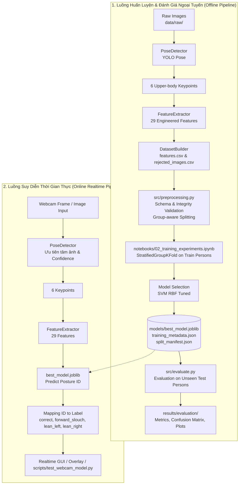

# Smart Posture Monitor - Tài Liệu Phân Tích & Đọc Hiểu Toàn Bộ Mã Nguồn (Phiên bản 27/09/2026)

Tài liệu này cung cấp cái nhìn toàn diện, chuyên sâu và chi tiết về toàn bộ kiến trúc, thuật toán, mã nguồn, dữ liệu, quy trình huấn luyện, đánh giá độc lập và kế hoạch phát triển của dự án **Smart Posture Monitor** (nhánh phiên bản V02 tính đến ngày 27/09/2026).

---

## MỤC LỤC
1. [Tổng Quan Dự Án](#1-tổng-quan-dự-án)
2. [Kiến Trúc Hệ Thống & Luồng Xử Lý (End-to-End Pipeline)](#2-kiến-trúc-hệ-thống--luồng-xử-lý-end-to-end-pipeline)
3. [Phân Tích Chi Tiết Từng Module Mã Nguồn (Codebase Walkthrough)](#3-phân-tích-chi-tiết-từng-module-mã-nguồn-codebase-walkthrough)
   - [3.1. Phát hiện dáng người: `src/pose_detector.py`](#31-phát-hiện-dáng-người-srcpose_detectorpy)
   - [3.2. Trích xuất đặc trưng hình học: `src/feature_extractor.py`](#32-trích-xuất-đặc-trưng-hình-học-srcfeature_extractorpy)
   - [3.3. Xây dựng tập dữ liệu: `src/dataset_builder.py`](#33-xây-dựng-tập-dữ-liệu-srcdataset_builderpy)
   - [3.4. Tiền xử lý & Chống rò rỉ dữ liệu: `src/preprocessing.py`](#34-tiền-xử-lý--chống-rò-rỉ-dữ-liệu-srcpreprocessingpy)
   - [3.5. Đánh giá kiểm thử độc lập: `src/evaluate.py`](#35-đánh-giá-kiểm-thử-độc-lập-srcevaluatepy)
   - [3.6. Thử nghiệm webcam thời gian thực: `scripts/test_webcam_model.py`](#36-thử-nghiệm-webcam-thời-gian-thực-scriptstest_webcam_modelpy)
   - [3.7. Công cụ kiểm tra ảnh lỗi: `scripts/copy_rejected_images.py`](#37-công-cụ-kiểm-tra-ảnh-lỗi-scriptscopy_rejected_imagespy)
   - [3.8. Các module kiến trúc đang ở trạng thái chuẩn bị (Placeholders)](#38-các-module-kiến-trúc-đang-ở-trạng-thái-chuẩn-bị-placeholders)
4. [Tập Dữ Liệu V02 & Phân Tích Dữ Liệu Khám Phá (EDA)](#4-tập-dữ-liệu-v02--phân-tích-dữ-liệu-khám-phá-eda)
5. [Huấn Luyện & Tuyển Chọn Mô Hình Machine Learning](#5-huấn-luyện--tuyển-chọn-mô-hình-machine-learning)
6. [Kết Quả Đánh Giá Trên Tập Kiểm Thử Độc Lập (Held-out Test Evaluation)](#6-kết-quả-đánh-giá-trên-tập-kiểm-thử-độc-lập-held-out-test-evaluation)
7. [Hệ Thống Kiểm Thử Tự Động (Testing & Quality Assurance)](#7-hệ-thống-kiểm-thử-tự-động-testing--quality-assurance)
8. [Hướng Dẫn Cài Đặt & Vận Hành Hệ Thống](#8-hướng-dẫn-cài-đặt--vận-hành-hệ-thống)
9. [Định Hướng Hoàn Thiện V02 & Nâng Cấp V03](#9-định-hướng-hoàn-thiện-v02--nâng-cấp-v03)

---

## 1. Tổng Quan Dự Án

### 1.1. Bối cảnh & Mục tiêu
Ngồi sai tư thế kéo dài là nguyên nhân hàng đầu gây ra các bệnh lý cơ xương khớp, thoái hóa đốt sống cổ, đau vai gáy và suy giảm hiệu suất làm việc của dân văn phòng, học sinh, sinh viên. **Smart Posture Monitor** là một hệ thống thị giác máy tính kết hợp máy học (Machine Learning) gọn nhẹ, chạy trực tiếp trên thiết bị cá nhân (Edge/Client-side) với đầu vào từ webcam thông thường hoặc ảnh chụp, nhằm:
- Giám sát tư thế ngồi liên tục trong thời gian thực.
- Phát hiện kịp thời các tư thế ngồi sai phổ biến.
- Cung cấp dữ liệu phục vụ cảnh báo tư thế và thống kê sức khỏe làm việc theo thời gian.

### 1.2. Các tư thế mục tiêu (Target Postures)
Hệ thống phân loại tư thế thành 4 trạng thái chính:

| Mã Nhãn (Label) | Class ID | Mô Tả Trạng Thái | Ý Nghĩa Thực Tế |
|---|:---:|---|---|
| `correct` | 0 | Tư thế ngồi chuẩn, thẳng lưng, đầu và vai cân bằng. | Cột sống ở trạng thái tự nhiên, giảm áp lực lên đĩa đệm. |
| `forward_slouch` | 1 | Cúi gập người, gù lưng, đầu vươn ra phía trước. | Tật "cổ rùa" (text neck), căng cơ vai gáy và chèn ép ngực. |
| `lean_left` | 2 | Nghiêng thân người hoặc nghiêng đầu sang bên trái. | Mất cân bằng cột sống một bên, lệch trục cơ hoành. |
| `lean_right` | 3 | Nghiêng thân người hoặc nghiêng đầu sang bên phải. | Tương tự nghiêng trái, tiềm ẩn nguy cơ vẹo cột sống. |

### 1.3. Lịch sử tiến hóa của dự án
- **Phiên bản V01 (Baseline ban đầu)**: Xây dựng bộ trích xuất 18 đặc trưng cơ bản từ 6 keypoints. Nhận diện ban đầu ở mức kiểm thử đơn giản.
- **Phiên bản V02 (Hiện tại - 27/09/2026)**:
  - Mở rộng tập đặc trưng lên **29 engineered features**, bổ sung các trục góc không gian, tọa độ tương đối theo trọng lực (gravity proxies), độ lệch trục và độ phân tán chiều cao.
  - Quy trình tiền xử lý nghiêm ngặt chống rò rỉ thông tin đối tượng (**Group Leakage Prevention**).
  - Thu thập và chuẩn hóa tập dữ liệu V02 với 4,014 mẫu hợp lệ từ 14 đối tượng người khác nhau.
  - Huấn luyện với cơ chế **StratifiedGroupKFold** (5 folds) và khóa riêng tập test độc lập (held-out test set gồm 3 người hoàn toàn chưa từng xuất hiện trong tập huấn luyện: `person01`, `person10`, `person12`).
  - Lựa chọn mô hình tốt nhất: **SVM RBF Tuned** (đạt độ chính xác **79.35%** và Macro F1 **77.91%** trên tập test unseen).
  - Hoàn thiện prototype suy diễn trực tiếp từ webcam với tốc độ 12-14 FPS trên CPU.

---

## 2. Kiến Trúc Hệ Thống & Luồng Xử Lý (End-to-End Pipeline)

Hệ thống được thiết kế theo 2 luồng xử lý phân tách rõ ràng: Luồng huấn luyện ngoại tuyến (Offline Training & Validation) và Luồng suy diễn trực tuyến (Online/Realtime Inference).



---

## 3. Phân Tích Chi Tiết Từng Module Mã Nguồn (Codebase Walkthrough)

### 3.1. Phát hiện dáng người: `src/pose_detector.py`
- **File**: [`src/pose_detector.py`](file:///d:/BTL/repo/smart-posture-monitor/src/pose_detector.py)
- **Lớp cốt lõi**: `PoseDetector`
- **Mô hình AI sử dụng**: `models/yolo26n-pose.pt` (Ultralytics YOLO Pose).
- **Cơ chế hoạt động**:
  1. Đọc frame ảnh dạng `numpy.ndarray` (BGR từ OpenCV).
  2. Chạy model dự đoán với ngưỡng confidence người: `person_conf_threshold = 0.5`.
  3. **Thuật toán chọn chủ thể chính (Best Person Selection)**: Khi có nhiều người trong khung hình (ví dụ môi trường văn phòng, người đi ngang qua), hệ thống tính điểm kết hợp:
     $$\text{Centrality Score} = \max\left(0, 1 - \frac{\text{Distance(Person Center, Frame Center)}}{\text{Max Center Distance}}\right)$$
     $$\text{Final Score} = 0.7 \times \text{Centrality Score} + 0.3 \times \text{Confidence Score}$$
     Điều này đảm bảo người ngồi làm việc chính diện trước camera luôn được chọn thay vì người ở rìa hoặc người đi lướt qua.
  4. **Lựa chọn 6 keypoints phần thân trên**:
     - `0 - nose`: Mũi
     - `1 - left_eye`: Mắt trái
     - `2 - right_eye`: Mắt phải
     - `3 - left_ear`: Tai trái
     - `5 - left_shoulder`: Vai trái
     - `6 - right_shoulder`: Vai phải
  5. **Loại bỏ hoàn toàn keypoint `right_ear` (index 4)**: Do góc đặt camera được quy chuẩn chếch góc khoảng 45 độ từ phía trước bên trái của người dùng, tai phải thường xuyên bị khuất hoặc có độ tin cậy thấp, việc loại bỏ giúp tránh đưa nhiễu vào mô hình.

---

### 3.2. Trích xuất đặc trưng hình học: `src/feature_extractor.py`
- **File**: [`src/feature_extractor.py`](file:///d:/BTL/repo/smart-posture-monitor/src/feature_extractor.py)
- **Lớp cốt lõi**: `FeatureExtractor`
- **Ngưỡng chất lượng đầu vào**: `min_keypoint_confidence = 0.35`. Bất kỳ điểm nào trong 6 keypoints có confidence dưới ngưỡng này hoặc không hữu hạn (`NaN`/`Inf`) thì toàn bộ frame sẽ bị từ chối (`return None`).
- **Hệ tọa độ cơ thể (Body Frame Normalization)**:
  - Gốc tọa độ đặt tại tâm hai vai: $\text{shoulder\_center} = \frac{\text{left\_shoulder} + \text{right\_shoulder}}{2}$.
  - Trục hoành cơ thể $\vec{u}_{\text{body}} = \frac{\text{right\_shoulder} - \text{left\_shoulder}}{\|\text{shoulder\_vector}\|}$.
  - Trục tung cơ thể $\vec{v}_{\text{body}}$ là vector vuông góc hướng lên trên đầu.
  - Mọi khoảng cách đều được chia cho chiều rộng hai vai ($\text{shoulder\_width}$), giúp các đặc trưng **bất biến với khoảng cách từ người dùng tới webcam** (ngồi gần hay ngồi xa camera không làm thay đổi giá trị đặc trưng).

#### Bảng danh mục 29 đặc trưng hình học (29 Engineered Features)

| Nhóm | Số | Tên Đặc Trưng | Công Thức / Ý Nghĩa Hình Học |
|---|:---:|---|---|
| **Góc & Chênh lệch cơ bản** | 1 | `shoulder_angle` | Góc nghiêng của đường nối hai vai so với phương ngang ảnh ($[-90^\circ, 90^\circ]$). |
| | 2 | `eye_shoulder_angle` | Góc lệch tương đối giữa trục hai mắt và trục hai vai. |
| | 3 | `eye_vertical_difference` | Độ chênh lệch cao độ hai mắt tính theo hệ trục cơ thể (chia cho `shoulder_width`). |
| **Tọa độ Body Frame** | 4-5 | `nose_x_body`, `nose_y_body` | Tọa độ x (trục vai) và y (trục dọc cơ thể) của mũi. |
| | 6-7 | `eye_center_x_body`, `eye_center_y_body` | Tọa độ x và y của tâm hai mắt trong Body Frame. |
| | 8-9 | `left_ear_x_body`, `left_ear_y_body` | Tọa độ x và y của tai trái trong Body Frame. |
| | 10-11 | `nose_eye_dx`, `nose_eye_dy` | Vector khoảng cách tương đối giữa mũi và tâm hai mắt chiếu lên trục cơ thể. |
| **Tỷ lệ khoảng cách** | 12 | `eye_width_ratio` | Tỷ lệ khoảng cách giữa hai mắt so với độ rộng hai vai ($\text{eye\_width} / \text{shoulder\_width}$). |
| | 13 | `ear_eye_ratio` | Tỷ lệ khoảng cách từ tai trái đến mắt trái so với độ rộng vai. |
| | 14 | `nose_shoulder_center_distance` | Khoảng cách chuẩn hóa từ mũi đến tâm hai vai. |
| | 15 | `eye_shoulder_center_distance` | Khoảng cách chuẩn hóa từ tâm hai mắt đến tâm hai vai. |
| **Độ bất đối xứng** | 16 | `nose_shoulder_asymmetry` | Chênh lệch khoảng cách từ mũi đến vai trái so với vai phải $(\text{dist}(N, L) - \text{dist}(N, R)) / W$. |
| | 17 | `eye_shoulder_asymmetry` | Chênh lệch khoảng cách từ tâm mắt đến hai bên vai. |
| | 18 | `nose_ear_ratio` | Khoảng cách từ mũi đến tai trái chia cho độ rộng vai. |
| **Góc không gian & Trọng lực** | 19 | `head_body_angle` | Góc nghiêng của trục đầu (tâm mắt) so với trục thẳng đứng cơ thể $\text{atan2}(x, y)$. |
| | 20 | `head_gravity_angle` | Góc có dấu giữa trục đầu (tâm vai $\to$ tâm mắt) và phương thẳng đứng trọng lực của ảnh ($0^\circ$ là hướng lên). |
| | 21 | `nose_gravity_angle` | Góc có dấu giữa trục mũi (tâm vai $\to$ mũi) và phương thẳng đứng trọng lực. |
| | 22 | `face_pitch_angle` | Góc ngẩng/cúi của khuôn mặt theo vector tương đối mũi - mắt. Phản ánh rất nhạy tư thế `forward_slouch`. |
| **Độ lệch trục thẳng đứng** | 23 | `eye_vertical_axis_offset` | Độ lệch phương ngang của tâm mắt so với đường thẳng đứng đi qua tâm vai. |
| | 24 | `nose_vertical_axis_offset` | Độ lệch phương ngang của mũi so với đường thẳng đứng đi qua tâm vai. |
| **Thống kê cao độ đầu** | 25 | `head_mean_height` | Cao độ trung bình của 3 mốc đầu: $(\text{nose\_y} + \text{eye\_y} + \text{ear\_y}) / 3$. |
| | 26 | `head_height_spread` | Độ lệch chuẩn (độ phân tán) cao độ của 3 mốc đầu. |
| **Góc các mốc phần đầu** | 27 | `nose_body_angle` | Góc của vector mũi so với trục đứng cơ thể. |
| | 28 | `ear_body_angle` | Góc của vector tai trái so với trục đứng cơ thể. |
| | 29 | `head_axis_angle_spread` | Độ lệch chuẩn phân tán giữa các góc trục đầu (mắt, mũi, tai). Thể hiện mức độ vặn/xoay đầu. |

---

### 3.3. Xây dựng tập dữ liệu: `src/dataset_builder.py`
- **File**: [`src/dataset_builder.py`](file:///d:/BTL/repo/smart-posture-monitor/src/dataset_builder.py)
- **Lớp cốt lõi**: `DatasetBuilder`
- **Cấu trúc thư mục dữ liệu quy định**:
  ```text
  data/raw/<label>/<person_id>_<session_id>/<file>
  Ví dụ: data/raw/correct/person01_session01/frame_0001.jpg
  ```
- **Quy trình thực thi**:
  1. Quét đệ quy toàn bộ file ảnh hợp lệ (`.jpg`, `.jpeg`, `.png`, `.bmp`, `.webp`) trong `data/raw/` và sắp xếp theo tên để đảm bảo tính tái lập.
  2. Phân tích cú pháp đường dẫn để bóc tách: `label`, `person_id`, `session_id`.
  3. Kiểm tra tính hợp lệ của metadata (nhãn phải thuộc 4 nhãn chuẩn, folder phải có format `personXX_sessionXX`).
  4. Đọc ảnh bằng `cv2.imread()`. Nếu lỗi, ghi vào file loại trừ.
  5. Chạy `PoseDetector.detect()`.
  6. Kiểm tra cấu trúc keypoints và độ tin cậy.
  7. Chạy `FeatureExtractor.extract()`. Đảm bảo đủ 29 giá trị số hữu hạn.
  8. Xuất mẫu hợp lệ vào `data/processed/features.csv` (gồm 4 cột metadata + 29 cột feature).
  9. Xuất toàn bộ các mẫu bị loại vào `data/rejected/rejected_images.csv` kèm phân loại nguyên nhân (`reason`) và chi tiết (`detail`), phục vụ cho việc kiểm tra chất lượng dữ liệu (Data Audit).

---

### 3.4. Tiền xử lý & Chống rò rỉ dữ liệu: `src/preprocessing.py`
- **File**: [`src/preprocessing.py`](file:///d:/BTL/repo/smart-posture-monitor/src/preprocessing.py)
- **Đóng gói dữ liệu đầu ra**: `PreparedDataset` (chứa `df`, `X`, `y`, `groups`, `metadata`, `feature_columns`).
- **Nguyên lý cốt lõi - Chống rò rỉ dữ liệu (No Data Leakage)**:
  - Không thực hiện chuẩn hóa toàn cục (`StandardScaler` toàn tập). Việc chuẩn hóa bắt buộc phải đưa vào bên trong `Pipeline` của `sklearn` để chỉ fit trên fold huấn luyện.
  - Không áp dụng PCA toàn cục, không dùng SMOTE toàn cục.
  - Không xóa outlier bằng quy tắc IQR cơ học (tránh mất các biến thiên tự nhiên của cơ thể người).
  - Không phân chia tập train/test ngẫu nhiên theo từng frame (`random frame split`). Nếu chia ngẫu nhiên theo frame, các frame liên tiếp của cùng một người trong cùng một buổi ngồi sẽ xuất hiện ở cả train và test, dẫn đến hiện tượng "học vẹt" đối tượng và ảo tưởng độ chính xác cao.
  - **Nhóm đối tượng (`groups = person_id`)**: Phân chia train/validation/test tuyệt đối theo từng con người cụ thể.
- **Hàm xử lý chính**: `prepare_dataset(csv_path, excluded_persons)`:
  1. `load_dataset()`: Đọc và kiểm tra file CSV không rỗng.
  2. `get_feature_columns()`: Đảm bảo đúng 29 cột đặc trưng từ `FeatureExtractor.FEATURE_NAMES`.
  3. `validate_schema()`: Kiểm tra 4 cột metadata, 4 nhãn dự kiến, kiểm tra toàn bộ feature phải có kiểu numeric.
  4. `validate_integrity()`: Bắt buộc không có missing values/NaN/Inf; không có dòng trùng lặp hoàn toàn; không có tình trạng cùng 1 đường dẫn ảnh lại gắn 2 nhãn khác nhau.
  5. `add_recording_id()`: Tạo khóa định danh duy nhất cho từng buổi quay: `recording_id = person_id + "__" + session_id`.
  6. `filter_protocol_invalid()`: Hỗ trợ loại bỏ các đối tượng vi phạm protocol thu thập dữ liệu (phiên bản V02 hiện tại `excluded_persons = ()` do dữ liệu `person05` đã được quay lại chuẩn).
  7. `prepare_model_data()`: Trích xuất ma trận `X` (chỉ 29 features), vector nhãn `y` (đã encode `0, 1, 2, 3`), mảng `groups` (`person_id`), và DataFrame `metadata` riêng biệt.

---

### 3.5. Đánh giá kiểm thử độc lập: `src/evaluate.py`
- **File**: [`src/evaluate.py`](file:///d:/BTL/repo/smart-posture-monitor/src/evaluate.py)
- **Mục đích**: Chạy đánh giá chính thức (Official Evaluation) trên tập kiểm thử unseen persons đã được "đóng băng" (locked holdout set).
- **Nguyên tắc "Bất khả xâm phạm"**: Script này tuyệt đối không huấn luyện lại mô hình, không tinh chỉnh tham số (no tuning), không chọn lại mô hình và không tự ý chia lại split.
- **Quy trình thực thi**:
  1. Đọc và đối chiếu mã băm **SHA256** của tập dữ liệu `features.csv`:
     `2bc189b67d6ac75dc8a95dfb487c743b16af0f99172eebf28ce725b6c5abbb62`
     Nếu tập dữ liệu bị thay đổi dù chỉ 1 bit, script sẽ cảnh báo/dừng lại.
  2. Nạp mô hình `models/best_model.joblib` và metadata `models/training_metadata.json`, `models/split_manifest.json`.
  3. Tái dựng lại chính xác 707 mẫu của 3 đối tượng kiểm thử: `person01`, `person10`, `person12`.
  4. Chạy `model.predict(X_test)`.
  5. Tính toán các chỉ số: `accuracy`, `balanced_accuracy`, `macro_precision`, `macro_recall`, `macro_f1`, `weighted_f1`.
  6. Xuất báo cáo chi tiết theo từng lớp (Per-class), theo từng đối tượng (Per-person), ma trận nhầm lẫn (dạng thô và dạng chuẩn hóa phần trăm), danh sách dự đoán sai (Misclassifications) và biểu đồ trực quan hóa ra thư mục `results/evaluation/`.

---

### 3.6. Thử nghiệm webcam thời gian thực: `scripts/test_webcam_model.py`
- **File**: [`scripts/test_webcam_model.py`](file:///d:/BTL/repo/smart-posture-monitor/scripts/test_webcam_model.py)
- **Mục đích**: Là integration test và prototype trực quan cho phép kiểm thử trực tiếp mô hình với webcam thật.
- **Cách thức hoạt động**:
  1. Khởi tạo `PoseDetector` và nạp `models/best_model.joblib`.
  2. Xác thực schema đặc trưng: kiểm tra thứ tự 29 feature của code hiện tại có khớp chính xác với `training_metadata.json` của model hay không.
  3. Mở camera qua OpenCV (`cv2.VideoCapture(camera_index)`).
  4. Vòng lặp đọc từng frame $\to$ trích xuất 6 keypoints $\to$ tính 29 features $\to$ bọc vào DataFrame $\to$ `model.predict()` $\to$ ánh xạ class ID sang text.
  5. Vẽ bounding box, keypoints với các màu sắc trực quan, hiển thị nhãn tư thế dự đoán, FPS thời gian thực, độ tin cậy (`predict_proba` nếu có).
  6. Hỗ trợ cờ `--no-pose` để tắt hiển thị khung xương/bbox nhằm tối ưu tốc độ render.

---

### 3.7. Công cụ kiểm tra ảnh lỗi: `scripts/copy_rejected_images.py`
- **File**: [`scripts/copy_rejected_images.py`](file:///d:/BTL/repo/smart-posture-monitor/scripts/copy_rejected_images.py)
- **Mục đích**: Đọc file `data/rejected/rejected_images.csv`, tìm các ảnh bị loại trong quá trình build dataset, chạy lại pose detection, vẽ bounding box, keypoint và in đè lý do bị loại (`reason`, `detail`) lên ảnh, sau đó lưu vào thư mục `data/rejected/rejected_img/`.
- Giúp đội ngũ phát triển dễ dàng kiểm tra trực quan xem ảnh bị reject do ánh sáng kém, người bị che khuất, hay do góc quay camera sai quy chuẩn.

---

### 3.8. Các module kiến trúc đang ở trạng thái chuẩn bị (Placeholders)
Trong cấu trúc dự án V02, một số file hiện tại là các placeholder rỗng (0 bytes) được định hình sẵn vị trí trong kiến trúc tổng thể cho phiên bản hoàn thiện sản phẩm:
- [`src/posture_predictor.py`](file:///d:/BTL/repo/smart-posture-monitor/src/posture_predictor.py): Sẽ là lớp wrapper cấp cao bọc toàn bộ luồng `PoseDetector + FeatureExtractor + Trained Model` thành 1 đối tượng duy nhất, trả về dự đoán chuẩn hóa cho tầng ứng dụng.
- [`src/temporal_monitor.py`](file:///d:/BTL/repo/smart-posture-monitor/src/temporal_monitor.py): Bộ lọc làm mượt theo chuỗi thời gian (Temporal Smoothing / Rolling Window / Debounce). Ngăn chặn hiện tượng giật nhãn (flickering) khi người dùng chỉ chớp mắt hoặc đổi tư thế trong 0.5 giây.
- [`src/session_statistics.py`](file:///d:/BTL/repo/smart-posture-monitor/src/session_statistics.py): Bộ theo dõi thống kê thời gian ngồi làm việc (tổng thời gian ngồi đúng, thời gian gù lưng liên tục, tính toán điểm tư thế - Posture Score theo phiên).
- [`src/train.py`](file:///d:/BTL/repo/smart-posture-monitor/src/train.py): Script dòng lệnh CLI độc lập đóng gói toàn bộ logic huấn luyện từ notebook `02_training_experiments.ipynb`.
- [`src/inference.py`](file:///d:/BTL/repo/smart-posture-monitor/src/inference.py): Cung cấp API suy diễn độc lập từ file ảnh hoặc video.
- [`app/app.py`](file:///d:/BTL/repo/smart-posture-monitor/app/app.py): Ứng dụng hoàn chỉnh tích hợp giao diện người dùng (GUI/Web Dashboard).

---

## 4. Tập Dữ Liệu V02 & Phân Tích Dữ Liệu Khám Phá (EDA)

### 4.1. Thống kê tập dữ liệu V02

Dữ liệu được thu thập từ nhiều đối tượng người ngồi trước bàn làm việc với camera đặt chếch một góc khoảng 45 độ bên trái.

| Chỉ Số Thống Kê | Giá Trị Số Học | Ghi Chú |
|---|---:|---|
| Tổng số ảnh thô ban đầu (Raw images) | **4,341** | Quét từ thư mục `data/raw/` |
| Số mẫu trích xuất hợp lệ (Valid samples) | **4,014** | Tỷ lệ hợp lệ: **92.47%** |
| Số mẫu bị loại (Rejected samples) | **327** | Do không đủ keypoint hoặc confidence $< 0.35$ |
| Tổng số đối tượng người tham gia (Persons) | **14** | `person01` đến `person14` |
| Tổng số phiên ghi hình (Recordings) | **16** | Đa số 1 session, riêng `person07` có 3 sessions |
| Số lượng lớp tư thế (Classes) | **4** | `correct`, `forward_slouch`, `lean_left`, `lean_right` |
| Số lượng đặc trưng hình học mỗi mẫu | **29** | Toàn bộ là kiểu số thực `float64` hữu hạn |

#### Phân bố mẫu giữa các lớp tư thế:
- `correct`: 1,051 mẫu (26.18%)
- `forward_slouch`: 889 mẫu (22.15%)
- `lean_left`: 1,054 mẫu (26.26%)
- `lean_right`: 1,020 mẫu (25.41%)
*(Tỷ lệ mẫu giữa lớp nhiều nhất và lớp ít nhất là 1.19x $\to$ Tập dữ liệu rất cân bằng, không cần kỹ thuật SMOTE hay oversampling)*.

### 4.2. Những phát hiện quan trọng từ EDA (`notebooks/01_eda_dataset.ipynb`)
1. **Tính trọn vẹn của dữ liệu (Data Integrity)**: Toàn bộ 4,014 mẫu không có bất kỳ giá trị thiếu (`NaN`), không có giá trị vô cùng (`+Inf`/`-Inf`), không có dòng dữ liệu nào bị trùng lặp.
2. **Đặc trưng có tính phân biệt đơn biến cao nhất**:
   - `shoulder_angle` (góc nghiêng vai) là đặc trưng mạnh nhất để phân biệt `lean_left` (góc nghiêng âm/dương rõ rệt) và `lean_right`.
   - `face_pitch_angle`, `nose_eye_dy`, `head_mean_height` là các đặc trưng cực kỳ nhạy bén với tư thế `forward_slouch` (khi gù lưng cúi người, đầu hạ thấp và khoảng cách mắt-mũi chiếu lên trục đứng thay đổi mạnh).
3. **Độ tương quan và dư thừa đặc trưng (Correlation & Redundancy)**: Phân tích ma trận tương quan Pearson tìm thấy 22 cặp đặc trưng có hệ số tương quan $|r| \ge 0.90$. Phân tích thành phần chính (PCA) cho thấy:
   - Cần 4 thành phần để giải thích $\ge 90\%$ phương sai.
   - Cần 6 thành phần để giải thích $\ge 95\%$ phương sai.
   Điều này chỉ ra 29 đặc trưng có tính dư thừa mang tính bổ trợ không gian, rất phù hợp với các thuật toán có khả năng xử lý phi tuyến tính như SVM kernel RBF.
4. **Biến thiên lớn giữa các cá nhân (Subject-to-Subject Variation)**: Tỷ lệ cơ thể (chiều dài cổ, tỷ lệ đầu/vai) và thói quen ngồi của mỗi người có sự khác biệt rõ rệt. Do đó, việc phân chia tập huấn luyện và kiểm thử theo từng cá nhân (`person_id`) là bắt buộc để đánh giá đúng khả năng tổng quát hóa (generalization) của mô hình.

---

## 5. Huấn Luyện & Tuyển Chọn Mô Hình Machine Learning

Toàn bộ quy trình thử nghiệm và tuyển chọn mô hình được thực hiện trong notebook [`notebooks/02_training_experiments.ipynb`](file:///d:/BTL/repo/smart-posture-monitor/notebooks/02_training_experiments.ipynb).

### 5.1. Phân chia tập dữ liệu (Data Splitting Strategy)
- Sử dụng chiến lược **Group Holdout**: Khóa cố định 3 đối tượng hoàn toàn độc lập làm tập kiểm thử cuối cùng:
  - **Tập kiểm thử (Test Persons - 3 người)**: `person01`, `person10`, `person12` (Gồm **707 mẫu**).
  - **Tập huấn luyện (Train Persons - 11 người)**: `person02`, `person03`, `person04`, `person05`, `person06`, `person07`, `person08`, `person09`, `person11`, `person13`, `person14` (Gồm **3,307 mẫu**).
- Không có bất kỳ hiện tượng rò rỉ nào giữa train và test (`person_overlap = []`, `recording_overlap = []`).

### 5.2. Đánh giá chéo nhóm (Group Cross-Validation Protocol)
- Trên 11 người của tập huấn luyện, thực hiện **StratifiedGroupKFold** với $K = 5$ folds.
- Nhóm được gán theo `person_id`. Đảm bảo trong mỗi lần lặp, người trong fold validation hoàn toàn không có trong fold train.
- Metric chính để so sánh và lựa chọn mô hình: **Macro F1-Score**.

### 5.3. Bảng xếp hạng kết quả tuyển chọn mô hình (Model Selection Results)

Dữ liệu tổng hợp từ [`results/model_selection_results.csv`](file:///d:/BTL/repo/smart-posture-monitor/results/model_selection_results.csv):

| Thứ Hạng | Tên Mô Hình | Nguồn | CV Macro F1 Mean | CV Macro F1 Std | Bộ Siêu Tham Số Tốt Nhất (Best Hyperparameters) |
|:---:|---|---|:---:|:---:|---|
| 🥇 **1** | **SVM RBF Tuned** | `GridSearchCV` | **0.6071** | **0.1701** | `{'model__C': 10, 'model__gamma': 0.001, 'model__class_weight': None}` |
| 2 | SVM RBF (Mặc định) | Baseline CV | 0.5601 | 0.1266 | Mặc định (`C=1.0, gamma='scale'`) |
| 3 | Logistic Regression | Baseline CV | 0.5205 | 0.1661 | Mặc định |
| 4 | XGBoost Tuned | `RandomizedSearchCV` | 0.5190 | 0.1256 | `n_estimators=600, max_depth=3, lr=0.05, subsample=0.8, colsample=1.0, reg_lambda=10` |
| 5 | Extra Trees | Baseline CV | 0.5133 | 0.1458 | Mặc định |
| 6 | XGBoost (Mặc định) | Baseline CV | 0.5083 | 0.1329 | Mặc định |
| 7 | Random Forest | Baseline CV | 0.4980 | 0.1508 | Mặc định |
| 8 | Dummy Classifier | Baseline CV | 0.1050 | 0.0054 | Chiếm đa số / Random |

**Kết luận tuyển chọn**:
- Mô hình **SVM RBF Tuned** (kết hợp `StandardScaler` bên trong Pipeline) vượt trội hơn hẳn các mô hình dạng cây quyết định (RandomForest, ExtraTrees, XGBoost) trên tập đặc trưng hình học 29 chiều liên tục.
- Lý do: Các đặc trưng tỷ lệ và góc hình học có quan hệ mượt mà trong không gian liên tục; Kernel RBF của SVM tạo ra các ranh giới quyết định phi tuyến mềm dẻo, ít bị overfit cục bộ theo từng đối tượng như cây quyết định.
- Mô hình cuối cùng được fit lại trên toàn bộ 3,307 mẫu của 11 training persons và lưu thành file artifact: [`models/best_model.joblib`](file:///d:/BTL/repo/smart-posture-monitor/models/best_model.joblib).

---

## 6. Kết Quả Đánh Giá Trên Tập Kiểm Thử Độc Lập (Held-out Test Evaluation)

Script [`src/evaluate.py`](file:///d:/BTL/repo/smart-posture-monitor/src/evaluate.py) đã thực thi đánh giá chính thức trên 707 mẫu của 3 đối tượng chưa từng thấy (`person01`, `person10`, `person12`).

### 6.1. Bảng số liệu tổng thể (Overall Metrics)

| Chỉ Số Đánh Giá (Metric) | Kết Quả Đạt Được | Ý Nghĩa |
|---|:---:|---|
| **Accuracy (Độ chính xác tổng thể)** | **79.35%** | Tỷ lệ dự đoán đúng toàn bộ mẫu trên tập kiểm thử (561/707 mẫu). |
| **Balanced Accuracy** | **78.81%** | Trung bình cộng độ thu hồi của cả 4 lớp (chống sai lệch kích thước lớp). |
| **Macro Precision** | **78.42%** | Độ chính xác trung bình không trọng số giữa các lớp. |
| **Macro Recall** | **78.81%** | Độ thu hồi trung bình không trọng số giữa các lớp. |
| **Macro F1-Score** | **77.91%** | Chỉ số đo lường hiệu năng tổng quát cân bằng. |
| **Weighted F1-Score** | **79.66%** | F1 có tính đến trọng số phân bố mẫu thực tế. |

### 6.2. Hiệu năng chi tiết theo từng lớp (Per-Class Performance)

Dữ liệu từ [`results/evaluation/classification_report.csv`](file:///d:/BTL/repo/smart-posture-monitor/results/evaluation/classification_report.csv):

| Lớp Tư Thế (Class) | Precision | Recall | F1-Score | Hỗ Trợ (Support) | Đánh Giá Chi Tiết |
|---|:---:|:---:|:---:|:---:|---|
| `correct` | **0.875** | **0.936** | **0.904** | 172 mẫu | **Rất xuất sắc**: Nhận diện chuẩn xác tư thế đúng, tỷ lệ bỏ sót chỉ 6.4%. |
| `lean_left` | **0.995** | **0.867** | **0.927** | 226 mẫu | **Gần như hoàn hảo về Precision**: Nếu model báo nghiêng trái, độ tin cậy là 99.5%. |
| `forward_slouch` | 0.564 | **0.773** | 0.652 | 132 mẫu | Thu hồi tốt (77.3%), nhưng precision còn thấp do bị nhầm với nghiêng phải. |
| `lean_right` | 0.703 | 0.576 | 0.634 | 177 mẫu | Mức nhận diện trung bình khá, hay bị nhầm sang cúi gù người. |

### 6.3. Ma trận nhầm lẫn (Confusion Matrix)

Dữ liệu từ [`results/evaluation/confusion_matrix.csv`](file:///d:/BTL/repo/smart-posture-monitor/results/evaluation/confusion_matrix.csv):

```text
Thực tế \ Dự đoán     correct   forward_slouch   lean_left   lean_right    Tổng
-----------------------------------------------------------------------------
correct                 161             2             0            9      172
forward_slouch            0           102             0           30      132
lean_left                 9            17           196            4      226
lean_right               14            60             1          102      177
```

#### Phân tích chuyên sâu về sự nhầm lẫn (Error Analysis):
- Hai lớp `correct` và `lean_left` hoạt động cực kỳ ổn định.
- **Hiện tượng nhầm lẫn lớn nhất**: Nằm giữa `forward_slouch` và `lean_right`. Cụ thể: có 60 mẫu `lean_right` bị dự đoán nhầm thành `forward_slouch`, và 30 mẫu `forward_slouch` bị dự đoán thành `lean_right`.
- **Nguyên nhân vật lý/hình học**: Do camera đặt ở góc chếch bên trái 45 độ. Khi đối tượng nghiêng người sang bên phải (`lean_right`), phần thân trên bị đẩy ra xa camera và hơi xoay về phía sau góc nhìn, làm cho độ cao đầu giảm xuống và khoảng cách mắt-mũi co lại, tạo ra dấu hiệu hình học rất giống với việc cúi gù người về phía trước (`forward_slouch`). Đây là bài toán cần xử lý bằng đặc trưng bù góc camera ở phiên bản V03.

### 6.4. Đánh giá tính tổng quát hóa theo từng đối tượng (Per-Person Evaluation)

| Đối Tượng Kiểm Thử | Số Mẫu | Accuracy | Macro F1 | Weighted F1 | Nhận Xét |
|---|:---:|:---:|:---:|:---:|---|
| `person01` | 148 | 79.73% | 0.6676 | 0.7690 | Khó khăn ở phân biệt nghiêng phải do góc ngồi đặc thù. |
| `person10` | 307 | 74.59% | 0.7449 | 0.7516 | Khá ổn định, nhận diện tư thế đúng rất tốt. |
| `person12` | 252 | **84.92%** | **0.8515** | **0.8517** | **Rất xuất sắc**: F1 đạt trên 85% trên một người hoàn toàn mới. |

---

## 7. Hệ Thống Kiểm Thử Tự Động (Testing & Quality Assurance)

Dự án thiết lập hệ thống kiểm thử tự động toàn diện qua pytest nhằm bảo vệ tính toàn vẹn của mã nguồn:

### 7.1. Bộ kiểm thử tiền xử lý dữ liệu: `tests/test_preprocessing.py`
Bao gồm **28 unit tests** bao phủ toàn bộ các tình huống lỗi dữ liệu:
- Kiểm tra nạp file CSV, báo lỗi khi file rỗng hoặc không tồn tại.
- Kiểm tra phát hiện thiếu cột metadata, sai số lượng feature, thừa/thiếu nhãn tư thế.
- Kiểm tra bắt lỗi khi có kiểu dữ liệu lạ (string trong cột feature).
- Kiểm tra phát hiện giá trị `NaN`, `+Inf`, `-Inf`.
- Kiểm tra phát hiện bản ghi trùng lặp (`duplicated rows`) hoặc cùng một ảnh có nhiều nhãn xung đột.
- Kiểm tra tính năng tạo `recording_id` duy nhất.
- Kiểm tra chức năng lọc đối tượng sai protocol (`filter_protocol_invalid`).
- Kiểm tra hàm `prepare_model_data()` bảo đảm không có metadata leakage vào `X`, bảo đảm số lượng mẫu khớp nhau giữa `X, y, groups, metadata`.

### 7.2. Bộ kiểm thử chức năng trực quan: `tests/test_pose_detector.py` & `tests/test_feature_extractor.py`
- Mở webcam trực tiếp qua OpenCV để kiểm tra tính năng phát hiện pose và vẽ 6 keypoints.
- Kiểm tra tốc độ trích xuất 29 features và in ra dictionary để kiểm tra trực quan.

---

## 8. Hướng Dẫn Cài Đặt & Vận Hành Hệ Thống

### 8.1. Yêu cầu hệ thống
- Hệ điều hành: Windows 10/11, Linux hoặc macOS.
- Python: Phiên bản **3.10** hoặc **3.11** (khuyến nghị 3.10+).
- Đã cài đặt Git.
- Có webcam kết nối với máy tính (nếu chạy realtime).

### 8.2. Cài đặt môi trường

Mở terminal (PowerShell trên Windows) tại thư mục gốc của project:

```powershell
# 1. Tạo môi trường ảo
python -m venv .venv

# 2. Kích hoạt môi trường ảo (Windows)
.venv\Scripts\activate

# 3. Nâng cấp pip và cài đặt dependencies
pip install --upgrade pip
pip install -r requirements.txt
```

*Kiểm tra file model YOLO pose*: Đảm bảo file trọng số `yolo26n-pose.pt` nằm trong thư mục [`models/yolo26n-pose.pt`](file:///d:/BTL/repo/smart-posture-monitor/models/yolo26n-pose.pt).

### 8.3. Bảng tổng hợp các câu lệnh thực thi

| Mục Đích Công Việc | Lệnh Dòng Lệnh (Command) |
|---|---|
| **Chạy toàn bộ unit tests tự động** | `python -m pytest tests/test_preprocessing.py -v` |
| **Kiểm tra pipeline tiền xử lý dữ liệu** | `python -m src.preprocessing` |
| **Xây dựng lại dataset từ ảnh thô** | `python -m src.dataset_builder` |
| **Audit ảnh bị loại khi build dataset** | `python scripts/copy_rejected_images.py` |
| **Chạy đánh giá chính thức trên test set** | `python -m src.evaluate` |
| **Chạy thử nghiệm webcam thời gian thực** | `python scripts/test_webcam_model.py` |
| **Chạy webcam với camera khác / tắt vẽ xương** | `python scripts/test_webcam_model.py --camera 1 --no-pose` |
| **Test thủ công Pose Detector qua webcam** | `python -m tests.test_pose_detector` |
| **Test thủ công Feature Extractor qua webcam** | `python -m tests.test_feature_extractor` |

---

## 9. Định Hướng Hoàn Thiện V02 & Nâng Cấp V03

### 9.1. Lộ trình hoàn thiện phiên bản sản phẩm V02
1. **Hoàn thiện các module phần mềm**:
   - Hiện thực hóa [`src/posture_predictor.py`](file:///d:/BTL/repo/smart-posture-monitor/src/posture_predictor.py) để trừu tượng hóa luồng `Detect -> Extract -> Predict` thành một interface duy nhất `predict(frame) -> PostureResult`.
   - Hiện thực hóa [`src/temporal_monitor.py`](file:///d:/BTL/repo/smart-posture-monitor/src/temporal_monitor.py) bằng cơ chế cửa sổ trượt (Moving Average / Majority Voting qua $N$ frames) nhằm loại bỏ rung giật dự đoán.
   - Hiện thực hóa [`src/session_statistics.py`](file:///d:/BTL/repo/smart-posture-monitor/src/session_statistics.py) tính toán thời gian ngồi đúng/sai, cảnh báo khi gù lưng liên tục quá 1-2 phút.
2. **Tích hợp ứng dụng người dùng (`app/app.py`)**:
   - Xây dựng giao diện đồ họa hiện đại (Modern Web UI hoặc Desktop App) có visual dashboard hiển thị chỉ số sức khỏe tư thế trực tiếp.

### 9.2. Định hướng nghiên cứu và nâng cấp phiên bản V03
1. **Giải quyết triệt để sự nhầm lẫn giữa `forward_slouch` và `lean_right`**:
   - Bổ sung các đặc trưng chiều sâu không gian (depth proxies) dựa trên tỷ lệ diện tích bounding box đầu hoặc độ co giãn của tam giác (mắt trái - mũi - tai trái).
   - Nghiên cứu thêm đặc trưng chuẩn hóa góc đặt camera (Camera Angle Calibration) trong giai đoạn khởi tạo (calibration step).
2. **Giảm thiểu biến thiên giữa các cá nhân (Cross-Subject Adaptation)**:
   - Nghiên cứu cơ chế "Personal Calibration": Khi người dùng bắt đầu làm việc, hệ thống yêu cầu ngồi chuẩn trong 3 giây để lấy offset cơ thể làm mốc cơ sở (baseline frame), sau đó mọi góc nghiêng sẽ được so sánh tương đối với mốc này.
3. **Giữ vững giao thức đánh giá chuẩn (Locked Protocol)**:
   - Khi phát triển V03, tiếp tục sử dụng cùng tập test độc lập (`person01`, `person10`, `person12`) và cùng metric Macro F1 để đối chiếu khách quan, minh bạch sự tiến bộ của thuật toán.

---
*Tài liệu được biên soạn và cập nhật tự động phục vụ quản lý chất lượng và phát triển dự án Smart Posture Monitor.*
