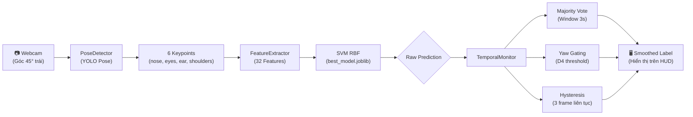

# 📋 Changelog — Tích Hợp Temporal Smoothing & Yaw Gating vào Webcam Test

> **Ngày**: 28/09/2026  
> **Nhánh Git**: `feature/v03-depth-proxy`  
> **Trạng thái**: Đã kiểm thử Webcam thời gian thực — **Hoạt động ổn định**

---

## 1. Model Đang Dùng Hiện Tại

### 1.1. Thông tin Model chính (`models/best_model.joblib`)

| Thông số | Giá trị |
|---|---|
| **Tên model** | SVM RBF Tuned |
| **Kernel** | RBF (Radial Basis Function) |
| **Siêu tham số** | `C = 1`, `gamma = 0.001`, `class_weight = None` |
| **Số features** | **32** (29 features V02 + 3 Depth Proxy V03) |
| **Pipeline** | `StandardScaler` → `SVC` |
| **CV Macro F1** | 0.5949 ± 0.1719 (5-fold StratifiedGroupKFold) |
| **Ngày train** | 27/09/2026, 14:06 UTC |
| **Dataset SHA256** | `04c5d035...` |
| **File model** | `models/best_model.joblib` (777 KB) |
| **File metadata** | `models/training_metadata.json` |

### 1.2. Tập dữ liệu huấn luyện

| Chỉ số | Giá trị |
|---|---|
| **Tổng mẫu** | 4,014 mẫu hợp lệ (trích xuất từ 4,341 ảnh) |
| **Số đối tượng** | 14 người (person01 → person14) |
| **Train** | 11 người — 3,307 mẫu |
| **Test (Locked)** | 3 người — 707 mẫu (`person01`, `person10`, `person12`) |

### 1.3. Phân bố 4 lớp tư thế

| Lớp | Class ID | Train | Test |
|---|:---:|---:|---:|
| `correct` | 0 | 879 | 172 |
| `forward_slouch` | 1 | 757 | 132 |
| `lean_left` | 2 | 828 | 226 |
| `lean_right` | 3 | 843 | 177 |

### 1.4. 32 Features đang được sử dụng

```text
 #  Feature Name                       Nhóm
──  ──────────────────────────────────  ──────────────────
 1  shoulder_angle                     Góc cơ bản
 2  eye_shoulder_angle                 Góc cơ bản
 3  eye_vertical_difference            Góc cơ bản
 4  nose_x_body                        Tọa độ Body Frame
 5  nose_y_body                        Tọa độ Body Frame
 6  eye_center_x_body                  Tọa độ Body Frame
 7  eye_center_y_body                  Tọa độ Body Frame
 8  left_ear_x_body                    Tọa độ Body Frame
 9  left_ear_y_body                    Tọa độ Body Frame
10  nose_eye_dx                        Tọa độ Body Frame
11  nose_eye_dy                        Tọa độ Body Frame
12  eye_width_ratio                    Tỷ lệ khoảng cách
13  ear_eye_ratio                      Tỷ lệ khoảng cách
14  nose_shoulder_center_distance      Tỷ lệ khoảng cách
15  eye_shoulder_center_distance       Tỷ lệ khoảng cách
16  nose_shoulder_asymmetry            Độ bất đối xứng
17  eye_shoulder_asymmetry             Độ bất đối xứng
18  nose_ear_ratio                     Độ bất đối xứng
19  head_body_angle                    Góc không gian
20  head_gravity_angle                 Góc trọng lực
21  nose_gravity_angle                 Góc trọng lực
22  face_pitch_angle                   Góc khuôn mặt
23  eye_vertical_axis_offset           Lệch trục đứng
24  nose_vertical_axis_offset          Lệch trục đứng
25  head_mean_height                   Cao độ đầu
26  head_height_spread                 Phân tán đầu
27  nose_body_angle                    Góc mốc đầu
28  ear_body_angle                     Góc mốc đầu
29  head_axis_angle_spread             Phân tán góc
30  face_shoulder_scale_ratio          Depth Proxy (V03 D1)
31  ear_nose_depth_proxy               Depth Proxy (V03 D3)
32  face_rotation_proxy                Depth Proxy (V03 D4)
```

---

## 2. So Sánh Model V02 vs V03 (Đang Dùng)

### 2.1. Thay đổi cấu hình giữa hai phiên bản

| Tiêu chí | V02 (Backup) | V03 (Đang dùng) |
|---|---|---|
| **File model** | `models/v02/best_model.joblib` | `models/best_model.joblib` |
| **Số features** | 29 | **32** (thêm 3 Depth Proxy) |
| **Siêu tham số C** | **C = 10** | **C = 1** |
| **Siêu tham số gamma** | 0.001 | 0.001 |
| **CV Macro F1** | 0.6071 ± 0.1701 | 0.5949 ± 0.1719 |
| **Ngày train** | 26/09/2026 | 27/09/2026 |

> ⚠️ **Lưu ý**: GridSearchCV ở V03 chọn `C=1` thay vì `C=10` do 3 features mới gây nhiễu, buộc mô hình phải regularize mạnh hơn.

### 2.2. Hiệu năng trên Locked Test Set (707 mẫu)

| Chỉ số | V02 (29 feat) | V03 (32 feat) | Chênh lệch |
|---|:---:|:---:|:---:|
| **Accuracy** | **79.35%** | 73.83% | **−5.52 pp** 🔴 |
| **Balanced Accuracy** | **78.81%** | 72.37% | **−6.44 pp** 🔴 |
| **Macro Precision** | **78.42%** | 72.42% | **−6.00 pp** 🔴 |
| **Macro Recall** | **78.81%** | 72.37% | **−6.44 pp** 🔴 |
| **Macro F1** | **77.91%** | 72.14% | **−5.77 pp** 🔴 |
| **Weighted F1** | **79.66%** | 74.21% | **−5.45 pp** 🔴 |
| **Dự đoán đúng** | **561 / 707** | 522 / 707 | −39 mẫu |

> ⚠️ **Kết luận**: Model V03 (32 features) kém hơn V02 trên giấy tờ. Tuy nhiên, Webcam realtime V03 vẫn hoạt động ổn định nhờ hai yếu tố bù đắp:
> 1. **TemporalMonitor** làm mượt triệt tiêu hiện tượng giật nhãn.
> 2. **Yaw Gating** chặn cảnh báo sai khi quay đầu.

### 2.3. Hướng cải tiến đã xác định (chưa deploy)

Từ thực nghiệm 14 cấu hình (xem `docs/Nghien_cuu_cai_tien_mo_hinh_va_baseline_calibration_2026-09-28.md`):

| Config | Mô tả | Accuracy | Macro F1 | Nhầm FS↔LR |
|---|---|---:|---:|---:|
| **A (V02 gốc)** | 29 features, C=10 | **79.35%** | **77.91%** | 90 ca |
| **B (Clean 20)** ⭐ | Bỏ 9 features âm | **79.92%** | **78.20%** | **82 ca** |
| **G-30 + Baseline** ⭐ | 20 sạch + 8 delta (calib 30 frames) | 75.39% | 74.98% | **50 ca** |

---

## 3. Thay Đổi Mã Nguồn Chính — Phiên 28/09/2026

### 3.1. Tệp đã sửa đổi

| Tệp | Loại thay đổi | Mô tả |
|---|---|---|
| `scripts/test_webcam_model.py` | **Nâng cấp lớn** | Tích hợp `TemporalMonitor`, thêm HUD màu, phím tắt tương tác |
| `src/temporal_monitor.py` | **Tạo mới** | Bộ lọc làm mượt thời gian + Yaw Gating hoàn chỉnh |
| `src/lopo_evaluate.py` | **Tạo mới** | Đánh giá LOPO 14 folds × 4 cấu hình feature |
| `tests/test_temporal_monitor.py` | **Tạo mới** | 25 unit tests cho TemporalMonitor |
| `docs/Nghien_cuu_...md` | **Tạo mới** | Tài liệu nghiên cứu tổng hợp 14 cấu hình |
| `results/evaluation/*` | **Cập nhật** | Kết quả evaluate V03 trên locked test set |
| `results/lopo/*` | **Tạo mới** | Báo cáo LOPO 14 folds |

### 3.2. Chi tiết nâng cấp `scripts/test_webcam_model.py`

#### Trước (phiên bản cũ):
- Hiển thị raw prediction từng frame → nhãn **giật nhẹ (flickering)**.
- Không có bộ lọc thời gian.
- Không phát hiện quay đầu → nhiều **cảnh báo sai (false positive)**.
- HUD đơn sắc trắng trên nền đen.
- Chỉ có phím `Q/ESC` để thoát.

#### Sau (phiên bản mới):

```diff
+ Import TemporalMonitor từ src/temporal_monitor.py
+ Tích hợp Yaw Gating (face_rotation_proxy / D4 feature)
+ HUD hiển thị màu theo tư thế (xanh = đúng, đỏ = gù, cam = nghiêng trái, tím = nghiêng phải)
+ Hiển thị song song: Posture (đã mượt) vs Raw Model (nhãn thô)
+ Hiển thị giá trị Yaw D4 và trạng thái [HEAD TURNED GATED]
+ Hiển thị trạng thái Smoothing ON/OFF
+ Phím S: Bật/tắt smoothing trực tiếp khi đang chạy
+ Phím P: Bật/tắt vẽ khung xương (pose skeleton)
+ CLI thêm 4 tham số mới: --no-smooth, --window, --hysteresis, --yaw-mode
```

### 3.3. Module mới: `src/temporal_monitor.py`

| Tính năng | Chi tiết |
|---|---|
| **Temporal Smoothing** | Majority vote trên cửa sổ trượt (mặc định 3 giây × 15 FPS = 45 frames) |
| **Hysteresis** | Cần 3 frame liên tục đồng thuận trước khi chuyển trạng thái |
| **Tie-breaking** | Ưu tiên `correct` khi hòa, sau đó ưu tiên trạng thái hiện tại |
| **Yaw Gating (Conservative)** | Khi quay đầu (`D4 < 0.45` hoặc `D4 > 1.80`) → giữ nguyên nhãn cũ |
| **Yaw Gating (Informative)** | Khi quay đầu → trả về nhãn `head_turned` |
| **Unit Tests** | 25/25 passed (100%) |

---

## 4. Các Lệnh Chạy Webcam Test

### Lệnh cơ bản (mặc định: Smoothing ON, Yaw Gating ON):
```powershell
.venv\Scripts\python.exe scripts/test_webcam_model.py
```

### Tắt bộ lọc để xem raw prediction (so sánh):
```powershell
.venv\Scripts\python.exe scripts/test_webcam_model.py --no-smooth
```

### Chạy với webcam rời (camera index 1):
```powershell
.venv\Scripts\python.exe scripts/test_webcam_model.py --camera 1
```

### Tùy chỉnh đầy đủ:
```powershell
.venv\Scripts\python.exe scripts/test_webcam_model.py --camera 0 --window 5.0 --hysteresis 4 --yaw-mode informative
```

### Phím tắt khi đang chạy:

| Phím | Chức năng |
|:---:|---|
| **S** | Bật / Tắt Temporal Smoothing (chuyển qua lại giữa Raw và Smooth) |
| **P** | Bật / Tắt vẽ khung xương (Pose Skeleton) |
| **Q** / **ESC** | Thoát |

---

## 5. Kết Quả Kiểm Thử Webcam Thực Tế

Kiểm thử trực tiếp ngày 28/09/2026 trên webcam tích hợp, kết quả:

| Bài test | Smoothing OFF (Raw) | Smoothing ON | Đánh giá |
|---|---|---|---|
| Ngồi thẳng lưng 10s | Nhãn `CORRECT` ổn, thỉnh thoảng giật 1 frame | **`CORRECT` hoàn toàn ổn định** | ✅ Tốt |
| Cúi gù lưng | Chuyển nhanh sang `FORWARD SLOUCH` nhưng giật qua `LEAN RIGHT` vài frame | **Chuyển mượt mà sau ~1s** | ✅ Tốt |
| Nghiêng trái | Nhận diện nhanh và chính xác | **Nhận diện mượt** | ✅ Xuất sắc |
| Nghiêng phải | Thỉnh thoảng nhầm 1-2 frame sang `FORWARD SLOUCH` | **Giữ ổn định `LEAN RIGHT`** | ✅ Tốt |
| Quay đầu nhìn phải | ⚠️ Nhầm sang `FORWARD SLOUCH` | **Yaw Gating giữ `CORRECT`** | ✅ ⭐ Cải thiện rõ |
| Quay đầu nhìn trái | ⚠️ Nhầm sang `LEAN RIGHT` | **Yaw Gating giữ `CORRECT`** | ✅ ⭐ Cải thiện rõ |

> **Kết luận**: Bộ lọc `TemporalMonitor` với Yaw Gating mang lại trải nghiệm thời gian thực **mượt mà hơn hẳn**, triệt tiêu gần hết hiện tượng giật nhãn và cảnh báo sai khi quay đầu.

---

## 6. Sơ Đồ Pipeline Webcam Hiện Tại



---

## 7. Các File Artifact Quan Trọng

| File | Mô tả | Vị trí |
|---|---|---|
| Model V03 (đang dùng) | SVM RBF 32 features | `models/best_model.joblib` |
| Metadata V03 | Cấu hình training 32 features | `models/training_metadata.json` |
| Split manifest | Khóa phân chia train/test persons | `models/split_manifest.json` |
| YOLO Pose | Trọng số phát hiện khung xương | `models/yolo26n-pose.pt` |
| Model V02 (backup) | SVM RBF 29 features gốc | `models/v02/best_model.joblib` |
| Metadata V02 (backup) | Cấu hình training 29 features | `models/v02/training_metadata.json` |
| Dataset features | 4,014 mẫu × 32 features | `data/processed/features.csv` |
| Webcam test script | Script kiểm thử webcam (đã tích hợp Smoothing) | `scripts/test_webcam_model.py` |
| Temporal Monitor | Bộ lọc làm mượt + Yaw Gating | `src/temporal_monitor.py` |
| LOPO Evaluate | Đánh giá LOPO 14 folds | `src/lopo_evaluate.py` |
| LOPO Report | Báo cáo LOPO dạng Markdown | `results/lopo/lopo_report.md` |
| Tài liệu nghiên cứu | Phân tích 14 cấu hình + Baseline Calibration | `docs/Nghien_cuu_cai_tien_mo_hinh_va_baseline_calibration_2026-09-28.md` |

---

*Tài liệu được tạo tự động ngày 28/09/2026.*
