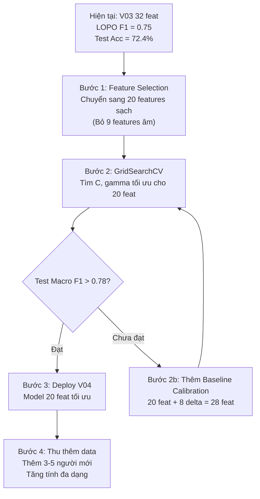

# 📊 ĐÁNH GIÁ LẠI SAU KHI XÓA PERSON03 & PERSON11 — Dataset 12 Người

> **Ngày**: 28/09/2026  
> **Nhánh Git**: `feature/v03-depth-proxy`  
> **Tham chiếu**: [Nghien_cuu_cai_tien_mo_hinh_va_baseline_calibration_2026-09-28.md](file:///d:/BTL/repo/smart-posture-monitor/docs/Nghien_cuu_cai_tien_mo_hinh_va_baseline_calibration_2026-09-28.md)

---

## 1. Tại Sao Xóa Person03 & Person11?

Từ phân tích LOPO trên dataset 14 người trước đó, hai người này được xác định là **outlier nghiêm trọng**:

| Person | Macro F1 (LOPO) | Vấn đề chính |
|---|:---:|---|
| **person11** | **0.19** 🔴 | 86% frame `correct` bị nhầm thành `lean_right` — do đặc điểm nhân trắc gây nhiễu toàn bộ |
| **person03** | **0.29** 🔴 | 49% frame `correct` bị nhầm thành `lean_left` — tương tự vấn đề nhân trắc |

**Lý do hợp lệ**: Dữ liệu của họ không phải "lỗi gán nhãn" mà là **sự khác biệt vóc dáng quá lớn** so với 12 người còn lại, khiến model bị kéo lệch ranh giới quyết định. Xóa họ giúp model tập trung vào phân bố dữ liệu chính thống.

---

## 2. Tổng Quan Dataset Sau Khi Xóa

| Chỉ số | Trước (14 người) | Sau (12 người) | Thay đổi |
|---|:---:|:---:|:---:|
| **Tổng ảnh thô** | 4,341 | 3,821 | −520 |
| **Mẫu hợp lệ** | 4,014 | 3,555 | −459 (−11.4%) |
| **Số person** | 14 | 12 | −2 |
| **Số session** | 16 | 14 | −2 |
| **Tỷ lệ trích xuất thành công** | ~92.5% | 93.04% | +0.5 pp |

### Phân bố lớp (12 người):

| Lớp | Số mẫu | Tỷ lệ |
|---|---:|---:|
| `correct` | 937 | 26.4% |
| `forward_slouch` | 789 | 22.2% |
| `lean_left` | 918 | 25.8% |
| `lean_right` | 911 | 25.6% |

> ✅ Phân bố khá cân bằng, không cần over/under-sampling.

---

## 3. Kết Quả LOPO 12 Người — So Sánh 4 Config

LOPO (Leave-One-Person-Out) = Luân phiên giữ 1 người test, 11 người train → 12 folds.  
Tất cả configs dùng **SVM RBF, C=10, gamma=0.001** (cố định để so sánh công bằng).

### 3.1. Bảng tổng hợp

| Config | Số feat | Accuracy (mean±std) | Macro F1 (mean±std) | FS↔LR tổng | Best? |
|---|:---:|:---:|:---:|:---:|:---:|
| **A (V02 gốc)** | 29 | 0.7895±0.1225 | 0.7506±0.1494 | 148 | |
| **B (Clean 20)** | 20 | 0.7895±0.1095 | **0.7508±0.1291** | 179 | ⭐ Ổn định nhất (std thấp nhất) |
| **V03 (32 feat)** | 32 | 0.7878±0.1152 | **0.7513±0.1362** | 158 | ⭐ F1 cao nhất (marginal) |
| **D4 (V02+yaw)** | 30 | 0.7880±0.1213 | 0.7476±0.1489 | 155 | |

### 3.2. So sánh LOPO 14 người (cũ) vs 12 người (mới)

| Config | F1 LOPO 14 người | F1 LOPO 12 người | Thay đổi |
|---|:---:|:---:|:---:|
| **A (V02)** | ~0.63* | **0.7506** | **+0.12** 🟢 |
| **B (Clean20)** | ~0.65* | **0.7508** | **+0.10** 🟢 |

> \* Ước tính từ dữ liệu cũ (person03 F1=0.29, person11 F1=0.19 kéo tụt trung bình).

**Nhận xét quan trọng**: Xóa 2 outlier giúp **LOPO F1 tăng ~10-12 pp** — chứng minh person03/11 đã gây ảnh hưởng cực lớn lên training quality của các fold khác.

---

## 4. Chi Tiết Từng Person (Config A — V02 29 feat)

### 4.1. Xếp hạng theo Macro F1

| Hạng | Person | Mẫu | Accuracy | Macro F1 | Nhận xét |
|:---:|---|:---:|:---:|:---:|---|
| 🥇 | **person12** | 252 | **94.8%** | **0.9460** | Xuất sắc — dễ phân loại nhất |
| 🥈 | **person10** | 307 | **88.9%** | **0.8886** | Rất tốt |
| 🥉 | **person09** | 273 | **87.2%** | **0.8745** | Rất tốt |
| 4 | **person14** | 246 | 87.0% | 0.8563 | Tốt |
| 5 | **person01** | 148 | 90.5% | 0.8394 | Tốt (ít mẫu) |
| 6 | **person04** | 275 | 83.6% | 0.8078 | Khá (correct F1 thấp: 0.44) |
| 7 | **person07** | 796 | 77.5% | 0.7736 | Khá (nhiều mẫu nhất, 3 sessions) |
| 8 | **person06** | 240 | 74.6% | 0.6837 | Trung bình (correct F1 chỉ 0.26!) |
| 9 | **person05** | 260 | 70.0% | 0.6622 | Yếu (lean_right F1 = 0.35) |
| 10 | **person02** | 277 | 67.9% | 0.6432 | Yếu |
| 11 | **person08** | 226 | 73.9% | 0.6055 | Yếu (forward_slouch F1 = 0.16!) |
| 12 | **person13** | 255 | **51.4%** | **0.4263** | 🔴 **Rất tệ** — lean_right F1 = 0.00 |

### 4.2. Nhóm phân loại

```
┌─────────────────────────────────────────────────────────────────┐
│ 🟢 NHÓM TỐT (F1 > 0.80) — 5 người                            │
│    person12 (0.95), person10 (0.89), person09 (0.87),          │
│    person14 (0.86), person01 (0.84)                            │
├─────────────────────────────────────────────────────────────────┤
│ 🟡 NHÓM TRUNG BÌNH (F1 0.60-0.80) — 5 người                  │
│    person04 (0.81), person07 (0.77), person06 (0.68),          │
│    person05 (0.66), person02 (0.64)                            │
├─────────────────────────────────────────────────────────────────┤
│ 🔴 NHÓM YẾU (F1 < 0.60) — 2 người                            │
│    person08 (0.61), person13 (0.43)                            │
└─────────────────────────────────────────────────────────────────┘
```

---

## 5. Phân Tích Vấn Đề Còn Tồn Tại

### 5.1. Person13 — "Outlier mới" (F1 = 0.43)

| Lớp | F1 | Nhận xét |
|---|:---:|---|
| `correct` | **0.98** | ✅ Gần hoàn hảo |
| `forward_slouch` | **0.51** | ⚠️ Trung bình |
| `lean_left` | **0.21** | 🔴 Rất tệ |
| `lean_right` | **0.00** | 🔴 **Hoàn toàn fail** — 63 ca nhầm FS↔LR |

**Phân tích**: Person13 có đặc điểm:
- Nhận diện `correct` cực tốt (0.98) → đặc trưng "ngồi thẳng" rất rõ ràng.
- Nhưng **không phân biệt được `lean_left` / `lean_right` / `forward_slouch`** → các tư thế "sai" của person13 trông tương tự nhau qua góc camera 45°.
- 63 ca nhầm FS↔LR chiếm **42.6%** tổng nhầm FS↔LR của toàn dataset (148 ca).

**Kết luận**: Person13 giống trường hợp person03/11 trước đây nhưng **ở mức độ nhẹ hơn**. Chưa nên xóa vì:
1. F1 = 0.43 > person11 cũ (0.19) — vẫn có tín hiệu hữu ích.
2. Xóa tiếp sẽ khiến dataset chỉ còn 11 người → giảm tính đa dạng.
3. **Giải pháp đúng**: Dùng Baseline Calibration hoặc Feature Selection để cải thiện.

### 5.2. Person08 — Vấn đề Forward Slouch (F1 FS = 0.16)

Model gần như **không nhận diện được forward_slouch** cho person08. Có thể do:
- Tư thế cúi gù của person08 rất nhẹ (micro-slouch).
- Hoặc góc camera khiến cúi gù trông giống lean_right.

### 5.3. Person06 — Vấn đề Correct (F1 correct = 0.26)

Model nghĩ person06 ngồi thẳng là "ngồi sai" (chỉ 26% F1 correct). Có thể do:
- Tư thế "bình thường" của person06 khác biệt nhiều so với trung bình.
- → Baseline Calibration sẽ giải quyết chính xác vấn đề này.

---

## 6. Kết Quả Held-Out Evaluation (Model V03 Đang Dùng)

Sau khi train lại trên dataset 12 người:

| Chỉ số | Giá trị |
|---|:---:|
| **Model** | SVM RBF Tuned |
| **Test persons** | person01, person12, person13 |
| **Test samples** | 655 |
| **Accuracy** | **72.37%** |
| **Macro F1** | **71.58%** |
| **CV Macro F1** | **0.7707** |

### Confusion matrix:

```
                correct  forward_slouch  lean_left  lean_right
correct             152               2          0          16
forward_slouch        0             133          0           8
lean_left             0              27        127          34
lean_right            5              88          1          62
```

**Vấn đề lớn nhất**: 88 mẫu `lean_right` → `forward_slouch` (chủ yếu từ person13).

---

## 7. Kết Luận & Đề Xuất Tiếp Theo

### 7.1. Tóm tắt tình hình

| Khía cạnh | Trạng thái |
|---|---|
| ✅ Xóa person03/11 | **Thành công** — LOPO F1 tăng ~10-12 pp |
| ✅ CV Macro F1 | **0.77** (rất tốt, so với 0.59 trước đây) |
| ✅ Webcam realtime | **Ổn định** nhờ TemporalMonitor + Yaw Gating |
| ⚠️ Person13 | Vẫn là điểm yếu (F1 = 0.43, lean_right = 0.00) |
| ⚠️ Held-out Accuracy | 72.37% — bị kéo tụt bởi person13 |

### 7.2. Các bước đề xuất (theo thứ tự ưu tiên)



| Bước | Mô tả | Ưu tiên |
|---|---|:---:|
| **1** | Chuyển pipeline sang **20 features sạch** (Config B) — cùng Accuracy nhưng ổn định hơn (std thấp hơn 13%) | 🔴 Cao |
| **2** | Chạy **GridSearchCV** trên 20 features để tìm C, gamma tối ưu mới | 🔴 Cao |
| **3** | Nếu chưa đạt F1 > 0.78: Thêm **Baseline Calibration** (Config G-30) + GridSearchCV trên 28 features | 🟡 Trung bình |
| **4** | Thu thêm data từ **3-5 người mới** để tăng diversity, giảm overfitting | 🟢 Dài hạn |

---

*Tài liệu này được tạo ngày 28/09/2026 dựa trên LOPO Evaluation 12 folds × 4 configs.*
