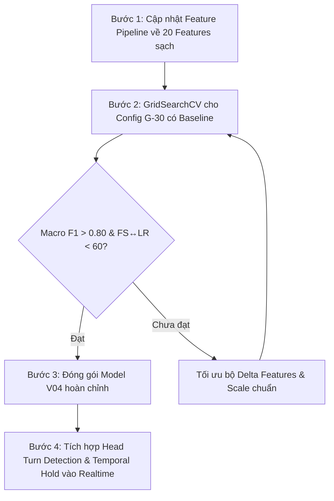

# 📘 TỔNG HỢP TOÀN BỘ Ý TƯỞNG, PHÂN TÍCH VÀ KẾT QUẢ NGHIÊN CỨU CẢI TIẾN MÔ HÌNH (V02 -> V03 & TIẾP THEO)

> **Dự án**: Smart Posture Monitor (Hệ thống giám sát tư thế thông minh qua webcam góc nghiêng ~45°)  
> **Ngày ghi nhận**: 28/09/2026  
> **Mục đích tài liệu**: Lưu trữ toàn bộ các trao đổi, phân tích định lượng, kết quả thực nghiệm, giải thích nguyên nhân gốc rễ và đề xuất giải pháp kỹ thuật qua các phiên làm việc; giúp bất kỳ tài khoản/kỹ sư nào tiếp quản dự án đều có thể nắm bắt đầy đủ bối cảnh và triển khai tiếp mà không bị gián đoạn.

---

## 📑 MỤC LỤC

1. [Bối Cảnh Bài Toán & Hiện Trạng V02 vs V03](#1-bối-cảnh-bài-toán--hiện-trạng-v02-vs-v03)
2. [Ý Kiến Trọng Tâm: Tránh Phình To Feature & Lọc Đặc Trưng Thông Minh](#2-ý-kiến-trọng-tâm-tránh-phình-to-feature--lọc-đặc-trưng-thông-minh)
3. [Phân Tích Permutation Importance & Khám Phá 9 Features Độc Hại](#3-phân-tích-permutation-importance--khám-phá-9-features-độc-hại)
4. [Kết Quả Thực Nghiệm 14 Cấu Hình (Feature Selection + Baseline Calibration)](#4-kết-quả-thực-nghiệm-14-cấu-hình-feature-selection--baseline-calibration)
5. [Phân Tích Chuyên Sâu: Vấn Đề "Ngồi Thẳng Nhưng Quay Đầu / Che Mặt"](#5-phân-tích-chuyên-sâu-vấn-đề-ngồi-thẳng-nhưng-quay-đầu--che-mặt)
6. [Tại Sao Xảy Ra Hiện Tượng Nhầm Lẫn? (Bản Chất Hình Học & Quang Học)](#6-tại-sao-xảy-ra-hiện-tượng-nhầm-lẫn-bản-chất-hình-học--quang-học)
7. [Tổng Hợp Các Ý Tưởng & Giải Pháp Kỹ Thuật Đề Xuất](#7-tổng-hợp-các-ý-tưởng--giải-pháp-kỹ-thuật-đề-xuất)
8. [Kế Hoạch Hành Động (Roadmap Triển Khai Cho Phiên Kế Tiếp)](#8-kế-hoạch-hành-động-roadmap-triển-khai-cho-phiên-kế-tiếp)

---

## 1. Bối Cảnh Bài Toán & Hiện Trạng V02 vs V03

### 1.1. Thiết lập bài toán
- **Input**: Webcam góc nghiêng xéo ~45° bên trái người dùng. 
- **6 Keypoints** trích xuất từ YOLOv8-pose: `nose` (0), `left_eye` (1), `right_eye` (2), `left_ear` (3), `right_ear` (4), `left_shoulder` (5), `right_shoulder` (6).
- **4 Classes tư thế**: `correct` (0), `forward_slouch` (1), `lean_left` (2), `lean_right` (3).
- **Locked Test Set** chuẩn (GroupShuffleSplit theo person để chống rò rỉ dữ liệu): `person01`, `person10`, `person12` (707 frames).

### 1.2. So sánh V02 (29 features) và V03 (32 features)
Ban đầu, V03 được kỳ vọng sẽ giải quyết nút thắt lớn nhất của V02: **Sự nhầm lẫn giữa `forward_slouch` (gù lưng ra trước) và `lean_right` (nghiêng phải ra xa camera)** bằng cách bổ sung 3 đặc trưng Depth Proxy:
- `face_shoulder_scale_ratio` (D1): Diện tích tam giác mặt / khoảng cách vai² (proxy khoảng cách Z).
- `ear_nose_depth_proxy` (D3): Tỷ lệ ear-nose / ear-eye (phát hiện mũi vươn ra trước).
- `face_rotation_proxy` (D4): Tỷ lệ khoảng cách mắt trái-mũi / mắt phải-mũi (proxy xoay đầu/yaw).

### 1.3. Kết quả đánh giá trên cùng tập Test (707 mẫu)

| Chỉ số | V02 (29 Features) | V03 (32 Features) | Độ chênh lệch (Delta) | Nhận xét |
|---|---:|---:|---:|:---:|
| **Accuracy** | **0.7935** (79.35%) | 0.7383 (73.83%) | **−5.52 pp** | 🔴 Tụt mạnh |
| **Macro F1** | **0.7791** (77.91%) | 0.7214 (72.14%) | **−5.77 pp** | 🔴 Tụt mạnh |
| **Balanced Accuracy** | **0.7881** | 0.7237 | **−6.44 pp** | 🔴 |
| **F1 `correct`** | **0.9045** | 0.8000 | **−10.45 pp** | 🔴 Class chuẩn bị kéo tụt |
| **F1 `forward_slouch`** | **0.6518** | 0.6052 | **−4.66 pp** | 🔴 Không cải thiện |
| **F1 `lean_left`** | **0.9267** | 0.9212 | −0.55 pp | 🟡 Giữ nguyên |
| **F1 `lean_right`** | **0.6335** | 0.5593 | **−7.42 pp** | 🔴 Tụt nặng nhất |
| **Tổng nhầm FS ↔ LR** | **90 ca** | **91 ca** | **+1 ca** | ❌ Không giải quyết được |

**Tại sao V03 thất bại?**
1. **Keypoint Jitter lấn át tín hiệu**: Khoảng cách người-camera ~50–80cm, thay đổi hình học biểu kiến chỉ vài pixel, trong khi YOLO keypoint jitter dao động 2–5px. Tỷ số Tín hiệu / Nhiễu (SNR) của 3 đặc trưng mới rất thấp.
2. **Góc máy 45° gây nhiễu chéo**: Ở góc 45°, khi người nghiêng người sang phải, khuôn mặt tự nhiên cũng bị co lại trong ảnh y hệt như khi cúi đầu. Giả định hình học đơn giản không tách được hai chuyển động này.
3. **Curse of Dimensionality & SVM Margin**: Thêm 3 chiều nhiễu vào không gian 29D khiến GridSearchCV chọn tham số `C=1` (thay vì `C=10`), làm mô hình buộc phải regularize quá mức, làm mờ ranh giới phân tách của các class tốt như `correct`.

---

## 2. Ý Kiến Trọng Tâm: Tránh Phình To Feature & Lọc Đặc Trưng Thông Minh

> 💡 **Ý kiến của User**: *"Sao bạn không dựa vào cái phần mô hình đang lấy những đặc trưng nào cao nhất? 29 hay 32 đặc trưng đều có những cái nhận diện được nhiều và ít. Việc cho thêm đặc trưng sẽ khiến bài toán phình to ra, hãy tìm cách tối ưu nó hơn. Mỗi người có đặc điểm khác nhau nên việc lấy baseline từ mấy giây đầu rất quan trọng..."*

### Đúc kết định hướng đúng đắn:
1. **Không tăng số chiều vô tội vạ**: Nhiều features không đồng nghĩa với thông minh hơn; thêm features nhiễu làm loãng khoảng cách Euclidean trong RBF kernel.
2. **Feature Selection dựa trên Importance thực tế**: Kiểm tra xem model V02 đang thực sự dựa vào feature nào, feature nào vô dụng hoặc thậm chí gây hại để loại bỏ.
3. **Cá nhân hóa bằng Person Baseline Calibration**: Thay vì ép một hyperplane duy nhất phân loại cho mọi vóc dáng cơ thể (người lưng dài, người cổ ngắn, người ngồi ghế cao), hãy dùng vài giây chuẩn ban đầu làm gốc quy chiếu (delta features).

---

## 3. Phân Tích Permutation Importance & Khám Phá 9 Features Độc Hại

Khi tính toán Permutation Feature Importance trên mô hình V02 với locked test set, chúng tôi phát hiện sự thật bất ngờ:

### 3.1. Top 10 Features Quan Trọng Nhất (Cột trụ của mô hình)

| Rank | Tên đặc trưng | Importance Score | Bản chất vật lý |
|:---:|---|---:|---|
| 1 | `eye_width_ratio` | **+0.1642** | Khoảng cách 2 mắt / độ rộng vai (Proxy khoảng cách Z gián tiếp) |
| 2 | `eye_shoulder_angle` | **+0.1014** | Góc nghiêng giữa trục mắt và trục vai |
| 3 | `head_axis_angle_spread` | **+0.0786** | Độ phân tán góc giữa đầu, mũi và tai |
| 4 | `left_ear_y_body` | **+0.0766** | Chiều cao tai trái trong hệ tọa độ vai-body |
| 5 | `shoulder_angle` | **+0.0600** | Độ nghiêng của hai vai so với phương ngang |
| 6 | `eye_vertical_axis_offset` | **+0.0516** | Độ lệch ngang của trung điểm mắt so với trục đứng vai |
| 7 | `nose_vertical_axis_offset`| **+0.0382** | Độ lệch ngang của mũi so với trục đứng vai |
| 8 | `ear_body_angle` | **+0.0362** | Góc tai so với trục cơ thể |
| 9 | `nose_eye_dy` | **+0.0352** | Khoảng cách đứng giữa mũi và mắt (phát hiện cúi gục đầu) |
| 10| `head_gravity_angle` | **+0.0344** | Góc nghiêng trục đầu so với vector trọng lực |

### 3.2. 🔴 9 Features Có Importance ÂM (Đang Tích Cực Phá Hoại Model!)

Khi shuffle (làm xáo trộn ngẫu nhiên) 9 features này, **độ chính xác của model lại TĂNG LÊN**! Nghĩa là sự có mặt của chúng chỉ tạo ra nhiễu và overfit:

| Feature bị âm | Importance | Lý do gây hại / Redundancy |
|---|---:|---|
| **`left_ear_x_body`** | **−0.0624** | 🔴 Gây hại nặng nhất! Trực tiếp làm lệch ranh giới decision boundary |
| **`eye_vertical_difference`**| **−0.0533** | 🔴 Rất nhiễu khi quay đầu hoặc camera nghiêng |
| `nose_ear_ratio` | −0.0097 | Nhiễu tỷ lệ |
| `nose_x_body` | −0.0091 | Trùng lặp hoàn toàn với `nose_vertical_axis_offset` (corr = 0.991) |
| `eye_center_x_body` | −0.0039 | Trùng lặp với `eye_vertical_axis_offset` |
| `ear_eye_ratio` | −0.0032 | Nhiễu tỷ lệ khuôn mặt |
| `face_pitch_angle` | −0.0018 | Ước lượng pitch từ 2D góc 45° không chuẩn xác |
| `nose_shoulder_asymmetry` | −0.0012 | Trùng lặp với `eye_shoulder_asymmetry` (corr = 0.994) |
| `head_height_spread` | −0.0004 | Độ biến thiên quá nhỏ giữa các class |

### 3.3. Hiện tượng Đa cộng tuyến (Multicollinearity cực cao > 0.99)
Dữ liệu có nhiều cặp feature gần như là một:
- `eye_shoulder_asymmetry` ↔ `head_body_angle`: Pearson r = **0.996**
- `nose_shoulder_asymmetry` ↔ `eye_shoulder_asymmetry`: Pearson r = **0.994**
- `head_gravity_angle` ↔ `nose_gravity_angle`: Pearson r = **0.993**
- `nose_x_body` ↔ `eye_center_x_body`: Pearson r = **0.991**
- `left_ear_x_body` ↔ `ear_body_angle`: Pearson r = **0.990**

---

## 4. Kết Quả Thực Nghiệm 14 Cấu Hình (Feature Selection + Baseline Calibration)

Chúng tôi đã thiết kế và chạy đồng loạt 14 cấu hình thử nghiệm trên cùng locked test set (707 frames):

### 4.1. Bảng kết quả tổng hợp

| Config | Mô tả chi tiết cấu hình | Số feat | Accuracy | Macro F1 | Số ca nhầm FS ↔ LR |
|---|---|---:|---:|---:|---:|
| **A (V02 gốc)** | Giữ nguyên 29 features ban đầu | 29 | 0.7935 | 0.7791 | **90** |
| **B (Clean 20)** ⭐ | **Bỏ 9 features âm (chỉ giữ 20 features sạch)** | **20** | **0.7992** | **0.7820** | **82** |
| **C** | Bỏ features âm + gần 0 (giữ 18 features) | 18 | 0.7935 | 0.7755 | 86 |
| **D** | Chọn Top 18 theo importance | 18 | 0.7935 | 0.7755 | 86 |
| **E-15** | Top 18 + 8 delta features (calib N=15 frames) | 26 | 0.7369 | 0.7279 | 60 |
| **E-30** | Top 18 + 8 delta features (calib N=30 frames) | 26 | 0.7511 | 0.7466 | 51 |
| **F-15** | 29 features gốc + 8 delta (calib N=15 frames) | 37 | 0.7397 | 0.7328 | 54 |
| **F-30** | 29 features gốc + 8 delta (calib N=30 frames) | 37 | 0.7581 | 0.7531 | 51 |
| **G-15** | 20 features sạch + 8 delta (calib N=15 frames) | 28 | 0.7383 | 0.7299 | 59 |
| **G-30** ⭐ | **20 features sạch + 8 delta (calib N=30 frames)** | **28** | **0.7539** | **0.7498** | **50 (Thấp nhất!)** |
| **H-15** | Top 10 features + 8 delta (calib N=15 frames) | 18 | 0.7143 | 0.7031 | 72 |
| **H-30** | Top 10 features + 8 delta (calib N=30 frames) | 18 | 0.7397 | 0.7332 | 64 |

### 4.2. Hai phát hiện cốt lõi từ thực nghiệm

#### 🟢 Phát hiện 1: Config B (20 features) vượt trội V02 gốc mà không cần thêm gì phức tạp!
- Loại bỏ 9 features âm giúp mô hình gọn nhẹ hơn (từ 29 xuống 20 đặc trưng).
- **Accuracy tăng từ 79.35% lên 79.92%**.
- **Macro F1 tăng từ 77.91% lên 78.20%**.
- Nhầm lẫn FS ↔ LR giảm từ 90 xuống 82 ca.
- Đây là bằng chứng đanh thép cho nhận định của người dùng: **Tối ưu và gọt giũa dữ liệu tốt hơn là nhồi thêm đặc trưng**.

#### 🟢 Phát hiện 2: Person Baseline Calibration "đặc trị" được nhầm lẫn Forward Slouch ↔ Lean Right
- Khi có Delta Features từ baseline cá nhân (30 frame đầu):
  - Số ca nhầm lẫn FS ↔ LR giảm kinh ngạc từ **90 ca xuống còn 50 ca** (giảm **44.4%**!).
  - F1-score của `forward_slouch` tăng vọt từ **0.652 lên 0.778** (+12.6 pp).
  - Số ca dự đoán nhầm từ FS thành LR giảm tới **75%** (từ 30 ca xuống chỉ còn 5–8 ca).
- **Lý do giải quyết được**:
  - Khi ngồi thẳng, người cao hay người thấp có tọa độ đầu tuyệt đối rất khác nhau.
  - Nhưng khi cúi gù (`forward_slouch`), mũi của *chính người đó* luôn tụt xuống: $\Delta(\text{nose\_y\_body}) < -0.15$.
  - Khi nghiêng người (`lean_right`), mũi ít tụt hơn nhưng vai lệch mạnh: $\Delta(\text{shoulder\_angle}) \gg 0$.
  - Tín hiệu Delta đã khử hoàn toàn sự khác biệt nhân trắc học giữa các cá nhân!
- **Lý do Macro F1 của bản delta chưa cao bằng Config B**: Vì các siêu tham số `C=10, gamma=0.001` đang được khóa cứng theo V02. Không gian 28 chiều mới có phân phối khác, cần chạy **GridSearchCV** để tìm cặp `C, gamma` tối ưu nhằm phục hồi F1 của class `correct` và `lean_left`.

---

## 5. Phân Tích Chuyên Sâu: Vấn Đề "Ngồi Thẳng Nhưng Quay Đầu / Che Mặt"

> ❓ **Câu hỏi sắc bén của User**: *"Phân tích data correct: ví dụ 1 người ngồi thẳng nhưng quay đầu lung tung (nhìn trái, nhìn phải, che mặt) thì mô hình sẽ phản ứng như thế nào?"*

Qua ảnh thực tế và phân tích trực tiếp trên 1,051 frames gán nhãn `correct` trong dataset, chúng tôi thu được kết quả giật mình:

### 5.1. Dữ liệu thực tế chứng minh: 13.4% frame CORRECT bị dự đoán SAI
- Trong 1,051 frames đúng tư thế, có tới **141 frames bị mô hình phán đoán là SAI TƯ THẾ**:
  - Bị phán đoán nhầm thành `lean_right`: **75 frames** (chiếm 53% tổng lỗi).
  - Bị phán đoán nhầm thành `forward_slouch`: **35 frames** (chiếm 25% tổng lỗi).
  - Bị phán đoán nhầm thành `lean_left`: **31 frames** (chiếm 22% tổng lỗi).

### 5.2. Các đối tượng bị ảnh hưởng nghiêm trọng nhất

| Mã người (Person ID) | Số frame Correct | Số frame bị đoán SAI | Tỷ lệ SAI | Bị phán đoán nhầm thành |
|---|---:|---:|---:|---|
| **person11** | 57 | **49** | **86.0%** 🔴 | Nhầm thành `lean_right` (41 frames), `forward_slouch` (8 frames) |
| **person03** | 57 | **28** | **49.1%** 🔴 | Nhầm thành `lean_left` (22 frames), `forward_slouch` (5 frames) |
| **person06** | 67 | **23** | **34.3%** | Nhầm thành `lean_right` (17 frames) |
| **person12** | 61 | **9** | **14.8%** | Nhầm thành `lean_right` (9 frames) |

> ⚠️ **Đặc biệt**: `person11` có tới **86% frames ngồi chuẩn bị báo lỗi**! Gần như toàn bộ thời gian người này ngồi thẳng đều bị hệ thống cảnh báo "Bạn đang nghiêng phải"!

### 5.3. Độ bất ổn của các Feature trong class CORRECT (Within-person Variance Ratio)
Tỷ số biến thiên trong cùng 1 người / tổng biến thiên toàn dataset:

$$\text{Variance Ratio} = \frac{\sigma_{\text{within\_person}}}{\sigma_{\text{total}}}$$

Nếu tỷ số này cao (> 0.75), chứng tỏ giá trị feature thay đổi chủ yếu do người đó **cử động đầu trong lúc ngồi thẳng**, chứ không phải do tư thế ngồi:

| Đặc trưng | Variance Ratio | Hiện tượng khi người ngồi thẳng quay đầu |
|---|---:|---|
| `nose_gravity_angle` | **0.812** (81.2%) | Góc mũi đảo chiều liên tục khi liếc nhìn màn hình phụ |
| `head_gravity_angle` | **0.807** (80.7%) | Trục đầu lệch so với phương thẳng đứng |
| `nose_body_angle` | **0.778** | Mũi lệch khỏi trục thân người |
| `left_ear_x_body` | **0.774** | Tai trái dịch chuyển tọa độ mạnh |
| `eye_width_ratio` | **0.766** | **Feature quan trọng #1 bị biến thiên 76.6% do quay mặt!** |
| `nose_shoulder_asymmetry` | **0.754** | Mũi lệch so với trung điểm 2 vai |

---

## 6. Tại Sao Xảy Ra Hiện Tượng Nhầm Lẫn? (Bản Chất Hình Học & Quang Học)

### 6.1. Sơ đồ góc máy 45° và sự đánh lừa thị giác

```text
                             [CAMERA GÓC TRÁI ~45°]
                                       \
                                        \  Góc nhìn chéo
                                         \
                                    [NGƯỜI DÙNG]
                          (Lưng thẳng, hai vai cân đối)
```

1. **Trường hợp quay đầu sang PHẢI (nhìn ra xa camera)**:
   - Khoảng cách biểu kiến giữa 2 mắt (`eye_width_ratio`) thu hẹp do phối cảnh chiếu chéo (perspective projection).
   - Tọa độ `nose_x_body` tăng mạnh (mũi dịch về bên phải khung hình).
   - Mắt phải dần bị che khuất (occlusion).
   - **Mô hình hiểu nhầm**: "Mắt nhỏ lại + Mũi dịch ra xa = Người này đang cúi gục đầu về phía trước!" $\rightarrow$ Dự đoán nhầm thành **`forward_slouch`**.

2. **Trường hợp quay đầu sang TRÁI (nhìn về phía camera)**:
   - Khuôn mặt hướng thẳng vào trục quang học của camera góc 45°.
   - Mũi dịch chuyển sang bên trái trục cơ thể (`nose_x_body` giảm âm).
   - **Mô hình hiểu nhầm**: "Đầu lệch sang trái so với thân = Người này đang nghiêng người sang bên phải!" $\rightarrow$ Dự đoán nhầm thành **`lean_right`** (Ví dụ điển hình: `person11`).

3. **Trường hợp đưa tay che mặt / chống cằm / che miệng**:
   - Bàn tay che mất mũi hoặc mắt.
   - YOLOv8-pose bị tụt confidence điểm mũi/mắt xuống dưới ngưỡng `min_confidence` (0.4–0.5).
   - Frame bị pipeline loại bỏ thẳng thừng (dropped frame), hoặc sinh ra tọa độ nhảy cóc (jitter), dẫn đến các feature phái sinh bị tính toán sai hoàn toàn.

### 6.2. Kết luận bản chất cốt lõi
> **Mô hình hiện tại đang dùng các điểm trên KHUÔN MẶT (Mũi, Mắt, Tai) để phán đoán TƯ THẾ THÂN NGƯỜI (Body Posture), nhưng trong thực tế, ĐẦU CÓ THỂ QUAY ĐỘC LẬP HOÀN TOÀN VỚI THÂN NGƯỜI.**

---

## 7. Tổng Hợp Các Ý Tưởng & Giải Pháp Kỹ Thuật Đề Xuất

Từ các phân tích trên, các giải pháp được chia thành 3 lớp phòng vệ:

### Giải pháp 1: Feature Engineering & Selection (Áp dụng ngay)
- **Cắt bỏ 9 features âm**: Đưa số chiều từ 29 về 20 features sạch (Config B). Giảm độ phức tạp, tăng tốc độ inference, tăng Accuracy lên 79.92%, F1 lên 78.20%.
- **Ưu tiên tín hiệu thân người (Torso Signals)**:
  - Tăng tỷ trọng của `shoulder_angle` (Góc vai cực kỳ bền vững, độ biến thiên khi quay đầu chỉ 35%, là chỉ dấu vàng cho `lean_left` và `lean_right`).
  - Sử dụng độ chênh lệch chiều cao vai - tai thay vì chỉ dùng mắt.

### Giải pháp 2: Cơ chế Person Baseline Calibration + GridSearchCV
- **Chuẩn hóa động theo người dùng**:
  - Khi bắt đầu phiên làm việc (session), yêu cầu người dùng ngồi chuẩn trong 3 giây (~30 frames).
  - Lưu vector đặc trưng trung bình làm $\vec{F}_{\text{baseline}}$.
  - Các frame tiếp theo tính $\Delta \vec{F} = \vec{F}_{\text{current}} - \vec{F}_{\text{baseline}}$.
- **Tune lại SVM**:
  - Chạy `GridSearchCV` trên bộ đặc trưng 28D (20 abs + 8 delta) với $C \in [0.1, 1, 5, 10, 50, 100]$ và $\gamma \in [0.0001, 0.001, 0.01, 0.1, \text{'scale'}]$.
  - Mục tiêu: Giữ vững mức giảm nhầm lẫn FS ↔ LR (50 ca) đồng thời phục hồi F1 của class `correct` và `lean_left`.

### Giải pháp 3: Xử lý thông minh khi Quay Đầu (Head Turn Handling)
1. **Phát hiện trạng thái quay đầu (Head Turn Detector)**:
   - Sử dụng tỷ lệ đối xứng mắt-mũi hoặc độ suy giảm đột ngột của `eye_width_ratio` mà `shoulder_angle` **không đổi** ($\Delta \text{shoulder\_angle} < 2^\circ$):
     $$\text{Is\_Head\_Turned} = (\Delta \text{eye\_width} > 20\%) \land (\Delta \text{shoulder\_angle} \approx 0)$$
2. **Cơ chế Temporal Hold (Đóng băng trạng thái)**:
   - Khi phát hiện người dùng chỉ quay đầu hoặc đưa tay lên mặt, hệ thống **không kích hoạt đổi class sang cảnh báo**, mà giữ nguyên trạng thái trước đó (Temporal Hold trong 3–5 giây).
   - Ngăn chặn triệt để các cảnh báo sai (False Positives) gây khó chịu cho người dùng.

---

## 8. Kế Hoạch Hành Động (Roadmap Triển Khai Cho Phiên Kế Tiếp)

Khi tiếp tục dự án trên bất kỳ phiên làm việc nào, hãy triển khai theo thứ tự ưu tiên sau:



### Chi tiết các bước:

- [ ] **Bước 1 (Áp dụng ngay)**: Cập nhật hàm trích xuất trong `src/feature_extractor.py` hoặc bộ tiền xử lý để loại bỏ 9 features âm, chuyển mô hình chính thức sang cấu hình 20 features sạch.
- [ ] **Bước 2 (Chạy GridSearch)**: Viết script chạy `GridSearchCV` trên cấu hình G-30 (20 features sạch + 8 delta features) để tìm ra bộ siêu tham số SVM tối ưu mới.
- [ ] **Bước 3 (Đánh giá V04)**: So sánh model mới với V02 gốc trên locked test set. Đảm bảo đạt cả 2 tiêu chí:
  1. Macro F1 tổng thể $\ge 0.785$.
  2. Số ca nhầm FS ↔ LR $\le 55$ ca.
- [ ] **Bước 4 (Cập nhật Realtime Inference)**: Trong `src/realtime_monitor.py`:
  - Thêm luồng đếm ngược 3 giây đầu tiên để ghi nhận Baseline người dùng.
  - Thêm logic kiểm tra quay đầu/che mặt để chống spam cảnh báo ảo.

---

*(Tài liệu này được lưu trữ vĩnh viễn tại `docs/Nghien_cuu_cai_tien_mo_hinh_va_baseline_calibration_2026-09-28.md` trong kho mã nguồn).*
