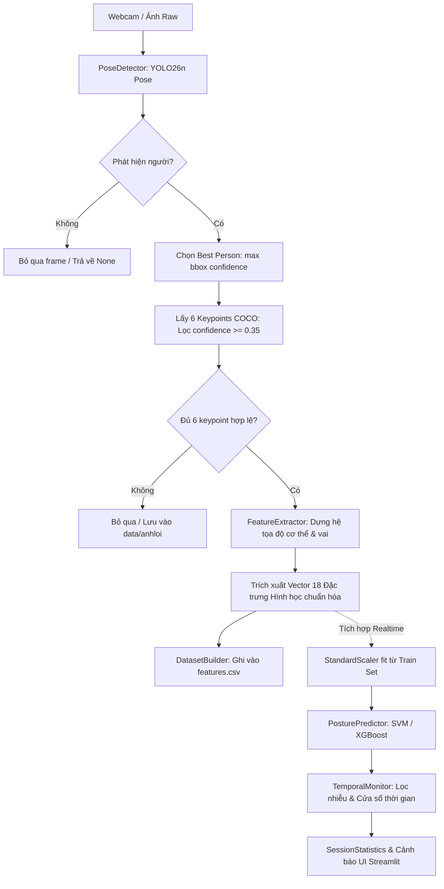

# BÁO CÁO TOÀN DIỆN VỀ KHẢO SÁT & ĐỌC HIỂU DỰ ÁN SMART POSTURE MONITOR

> **Dự án:** Smart Posture Monitor (Hệ thống giám sát và nhận diện tư thế ngồi làm việc thông minh)  
> **Nhánh Git hiện tại:** `dev-manh`  
> **Phạm vi thẩm định:** Toàn bộ cấu trúc thư mục, mã nguồn, dữ liệu trích xuất và tài liệu kỹ thuật trong repository `smart-posture-monitor`  
> **Thời điểm cập nhật:** 25/09/2026  

---

## 1. TỔNG QUAN DỰ ÁN & PHÂN CÔNG NHÂN SỰ

### 1.1. Mục tiêu bài toán
Hệ thống giải quyết vấn đề nhận diện tư thế ngồi sai của người làm việc trước máy tính theo thời gian thực nhằm đưa ra cảnh báo kịp thời, hạn chế các bệnh lý học đường và văn phòng (thoái hóa đốt sống cổ, gù lưng, cong vẹo cột sống). 

Khác với các hướng tiếp cận deep learning end-to-end (đưa trực tiếp ảnh raw vào mạng CNN/ResNet tốn nhiều tài nguyên tính toán và dễ overfit với phông nền), dự án áp dụng **hybrid pipeline**:
1. Sử dụng mạng thị giác máy tính siêu nhẹ (**YOLO26n Pose**) để trích xuất khung xương / tọa độ điểm mốc (keypoints).
2. Xây dựng **hệ tọa độ tương đối cơ thể** và trích xuất **vector 18 đặc trưng hình học**.
3. Huấn luyện các mô hình **Machine Learning cổ điển (SVM, XGBoost)** trên tập đặc trưng hình học để phân loại 4 tư thế với chi phí tính toán thấp, độ trễ nhỏ, chạy mượt mà trên webcam thông thường.

### 1.2. Phân công vai trò kỹ thuật trong nhóm
Theo bản thỏa thuận kỹ thuật tại `Smart Posture Monitor (1).md`, nhóm gồm 3 kỹ sư với ranh giới trách nhiệm (module boundaries) rõ ràng:

| Thành viên | Phụ trách chính | Module quản lý | Trạng thái hiện tại |
| :--- | :--- | :--- | :--- |
| **Quang** | Computer Vision & Feature Interface | `src/pose_detector.py` `src/feature_extractor.py` `tests/test_pose_detector.py` `tests/test_feature_extractor.py` | ✅ **Hoàn thành 100%** & Đã bàn giao |
| **Mạnh** | Machine Learning & Data Processing | `src/dataset_builder.py` `src/export_failed_frames.py` `src/export_valid_frames.py` `src/preprocessing.py` `src/train.py` `src/evaluate.py` | 🟡 **Đang thực hiện** (Đã tạo CSV 2.888 mẫu, chuẩn bị train) |
| **Quân** | Application & System Integration | `src/posture_predictor.py` `src/temporal_monitor.py` `src/session_statistics.py` `app/app.py` | ⏳ **Chờ kết quả mô hình** để tích hợp UI & logic cảnh báo |

---

## 2. KIẾN TRÚC HỆ THỐNG & LUỒNG DỮ LIỆU END-TO-END

### Chi tiết luồng thời gian thực (Inference Pipeline):
1. **Thu nhận hình ảnh:** OpenCV đọc từng frame từ Webcam.
2. **Pose Detection:** Model `yolo26n-pose.pt` phát hiện khung xương. Nếu có nhiều người trong khung hình, thuật toán chọn người có `bbox confidence` lớn nhất.
3. **Lọc chất lượng điểm mốc:** Chỉ lấy 6 điểm mốc chuẩn. Nếu có bất kỳ điểm nào có `confidence < 0.35` hoặc khoảng cách 2 vai gần bằng 0, frame bị hủy ngay lập tức nhằm bảo vệ chất lượng dữ liệu.
4. **Chuẩn hóa không gian:** Chuyển đổi tọa độ pixel tuyệt đối sang hệ tọa độ tương đối đặt tại tâm hai vai, chia tỉ lệ cho độ rộng hai vai (`shoulder_width`).
5. **Dự đoán nhãn:** Vector 18 chiều sau khi chuẩn hóa bởi `StandardScaler` được đưa vào mô hình phân loại.
6. **Làm mượt & Cảnh báo:** `TemporalMonitor` duy trì bộ đệm trượt (sliding window) để tránh hiện tượng nhấp nháy nhãn (flickering), chỉ phát cảnh báo âm thanh/hình ảnh khi tư thế xấu duy trì vượt quá ngưỡng thời gian cấu hình (ví dụ: liên tục > 5 giây hoặc chiếm ≥ 80% cửa sổ gần nhất).

---

## 3. CÁC QUYẾT ĐỊNH THIẾT KẾ KỸ THUẬT THEN CHỐT

### 3.1. Thiết lập góc đặt Camera 45° bên trái người dùng
* **Bối cảnh:** Các hệ thống giám sát tư thế thường đặt camera chính diện (0°). Tuy nhiên, khi ngồi làm việc thực tế, hành vi "gù lưng / cúi gập cổ về phía trước" (`forward_slouch`) theo phương thẳng đứng đối diện chỉ làm đầu to hơn một chút hoặc hạ thấp rất ít trên mặt phẳng 2D ảnh, cực kỳ khó phân biệt với việc người dùng ngồi gần lại camera.
* **Quyết định:** Đặt camera chếch góc khoảng **45° về phía bên trái** người dùng.
* **Lợi ích:** Mọi chuyển động cúi đầu, vươn cổ về phía màn hình sẽ chiếu lên mặt phẳng ảnh 2D thành độ dịch chuyển rõ rệt trên cả trục X (ngang) và trục Y (dọc), giúp độ nhạy phát hiện `forward_slouch` tăng vượt bậc.

### 3.2. Quyết định loại bỏ hoàn toàn `right_ear` (Tai phải)
* **Vấn đề nảy sinh:** Do camera đặt lệch 45° bên trái, tai phải của người dùng thường xuyên rơi vào vùng khuất (self-occlusion do đầu che) hoặc confidence của YOLO Pose dao động bất thường (nhấp nháy giữa 0.05 và 0.40).
* **Quyết định:** Dự án **loại bỏ dứt điểm `right_ear` (COCO index 4)** khỏi mọi khâu từ huấn luyện đến suy luận, chỉ giữ lại đúng **6 keypoints cốt lõi**:
  1. `nose` (COCO index 0)
  2. `left_eye` (COCO index 1)
  3. `right_eye` (COCO index 2)
  4. `left_ear` (COCO index 3)
  5. `left_shoulder` (COCO index 5)
  6. `right_shoulder` (COCO index 6)
* **Tác động:** Giữ vững tính nhất quán tuyệt đối của không gian vector đầu vào, không cần impute giá trị khuyết thiếu khi tai phải bị che khuất.

### 3.3. Hệ tọa độ tương đối cơ thể (Body Coordinate System) & Chuẩn hóa độ rộng vai
* **Gốc tọa độ cơ thể:** Được đặt tại trung điểm đường nối hai vai:  
  $$\text{shoulder\_center} = \frac{\text{left\_shoulder} + \text{right\_shoulder}}{2}$$
* **Hệ trục cơ sở chuẩn hóa:**
  * Chiều dài cơ sở (Độ rộng hai vai): $\text{shoulder\_width} = \|\text{right\_shoulder} - \text{left\_shoulder}\|$
  * Trục hoành cơ thể ($\vec{u}_{\text{shoulder}}$): Vector đơn vị hướng từ vai trái sang vai phải.
  * Trục tung cơ thể ($\vec{u}_{\text{up}}$): Vector đơn vị trực giao với $\vec{u}_{\text{shoulder}}$ và luôn hướng lên đỉnh đầu (ngược chiều trục Y màn hình).
* **Bất biến hình học:** Mọi tọa độ điểm $P$ đều được chiếu thành $(x_{\text{body}}, y_{\text{body}})$ theo công thức:
  $$x_{\text{body}} = \frac{(P - \text{shoulder\_center}) \cdot \vec{u}_{\text{shoulder}}}{\text{shoulder\_width}}, \quad y_{\text{body}} = \frac{(P - \text{shoulder\_center}) \cdot \vec{u}_{\text{up}}}{\text{shoulder\_width}}$$
  Nhờ phép biến đổi này, hệ thống đạt tính bất biến với:
  - Vị trí của người dùng trong khung hình (ngồi góc trái, góc phải, chính giữa).
  - Khoảng cách từ người dùng tới webcam (ngồi xa, ngồi gần).
  - Tạng người / kích thước cơ thể khác nhau.

---

## 4. ĐẶC TẢ CHI TIẾT 18 ĐẶC TRƯNG HÌNH HỌC (FEATURE VECTOR)

Thứ tự 18 đặc trưng được cố định bất di bất dịch tại `FeatureExtractor.FEATURE_NAMES`:

| STT | Tên Feature | Công thức / Bản chất hình học | Ý nghĩa nhận diện tư thế |
| :---: | :--- | :--- | :--- |
| **1** | `shoulder_angle` | Góc tạo bởi vector hai vai so với phương ngang ảnh ($[-90^\circ, 90^\circ]$) | Đo độ nghiêng của thân trên/hai vai; bắt `lean_left`, `lean_right`. |
| **2** | `eye_shoulder_angle` | Độ lệch góc giữa đường nối hai mắt và đường nối hai vai | Nhận biết việc đầu nghiêng độc lập so với vai. |
| **3** | `eye_vertical_difference` | $(\text{eye\_vector} \cdot \vec{u}_{\text{up}}) / \text{shoulder\_width}$ | Độ chênh lệch cao độ giữa hai mắt theo trục cơ thể. |
| **4** | `nose_x_body` | Tọa độ X của mũi trong hệ tọa độ vai | Vị trí ngang của đầu; lệch trái/phải khi nghiêng người. |
| **5** | `nose_y_body` | Tọa độ Y của mũi trong hệ tọa độ vai | **Đặc trưng vàng cho `forward_slouch`**: khi gù lưng cúi đầu, giá trị này tụt giảm mạnh. |
| **6** | `eye_center_x_body` | Tọa độ X của trung điểm hai mắt trong hệ vai | Tâm mặt lệch sang trái hay phải. |
| **7** | `eye_center_y_body` | Tọa độ Y của trung điểm hai mắt trong hệ vai | Cao độ khuôn mặt; bổ trợ mạnh cho việc nhận diện cúi gập đầu. |
| **8** | `left_ear_x_body` | Tọa độ X của tai trái trong hệ vai | Kiểm tra mức độ xoay và nghiêng đầu của người dùng. |
| **9** | `left_ear_y_body` | Tọa độ Y của tai trái trong hệ vai | Cao độ tai trái so với vai. |
| **10** | `nose_eye_dx` | Độ lệch ngang giữa mũi và trung điểm hai mắt chia cho vai | Độ nghiêng mặt hoặc quay mặt sang bên. |
| **11** | `nose_eye_dy` | Độ dịch dọc giữa mũi và trung điểm hai mắt chia cho vai | Góc chúc/ngửa của khuôn mặt (head pitch). |
| **12** | `eye_width_ratio` | $\|\text{right\_eye} - \text{left\_eye}\| / \text{shoulder\_width}$ | Khoảng cách hai mắt; thay đổi khi quay mặt góc 45°. |
| **13** | `ear_eye_ratio` | $\|\text{left\_ear} - \text{left\_eye}\| / \text{shoulder\_width}$ | Phản ánh hướng quay và độ cúi của đầu. |
| **14** | `nose_shoulder_center_distance` | $\|\text{nose} - \text{shoulder\_center}\| / \text{shoulder\_width}$ | Khoảng cách tương đối từ mũi đến cổ/ngực. |
| **15** | `eye_shoulder_center_distance` | $\|\text{eye\_center} - \text{shoulder\_center}\| / \text{shoulder\_width}$ | Khoảng cách khuôn mặt đến ngực. |
| **16** | `nose_shoulder_asymmetry` | $(\text{dist}(\text{nose}, \text{left\_shoulder}) - \text{dist}(\text{nose}, \text{right\_shoulder})) / \text{width}$ | Độ bất đối xứng giữa mũi và 2 vai; phân biệt dứt khoát `lean_left` và `lean_right`. |
| **17** | `eye_shoulder_asymmetry` | $(\text{dist}(\text{eye\_ctr}, \text{left\_shoulder}) - \text{dist}(\text{eye\_ctr}, \text{right\_shoulder})) / \text{width}$ | Bổ trợ phân loại hướng nghiêng cơ thể. |
| **18** | `nose_ear_ratio` | $\|\text{nose} - \text{left\_ear}\| / \text{shoulder\_width}$ | Tỷ lệ khoảng cách mũi - tai trái; xác định góc quay đầu 3D. |

---

## 5. HIỆN TRẠNG MÃ NGUỒN & CẤU TRÚC THƯ MỤC

### 5.1. Bảng kiểm kê trạng thái từng file mã nguồn

| Đường dẫn file | Dòng code | Trạng thái kỹ thuật | Đánh giá & Trách nhiệm |
| :--- | :---: | :---: | :--- |
| `src/pose_detector.py` | 303 | Hoàn chỉnh | Đã kiểm thử ổn định với YOLO26n Pose, xử lý đa người, trả về 6 keypoints. |
| `src/feature_extractor.py` | 649 | Hoàn chỉnh | Đầy đủ logic chuẩn hóa hình học, trích xuất 18 features, kiểm tra finite/confidence. |
| `src/dataset_builder.py` | 203 | Hoàn chỉnh | Xử lý hàng loạt ảnh, parse metadata thư mục, trích xuất đặc trưng ra CSV. |
| `src/export_failed_frames.py` | 187 | Hoàn chỉnh | Công cụ gỡ lỗi (visual debug) xuất ảnh bị lỗi vào `data/anhloi/`. |
| `src/export_valid_frames.py` | 193 | Hoàn chỉnh | Công cụ kiểm chứng xuất ảnh đúng kèm khung xương vào `data/anhdung/`. |
| `tests/test_pose_detector.py` | 368 | Hoàn chỉnh | Test realtime với OpenCV webcam, vẽ skeleton và hiển thị confidence. |
| `tests/test_feature_extractor.py` | 250 | Hoàn chỉnh | Test realtime trích xuất 18 features trực tiếp từ webcam. |
| `src/preprocessing.py` | 1 (trống) | Chờ triển khai | Cần viết: đọc CSV, chia GroupKFold/Session, fit StandardScaler. |
| `src/train.py` | 1 (trống) | Chờ triển khai | Cần viết: Huấn luyện Baseline, SVM (RBF/Linear), XGBoost, lưu checkpoint `.pkl`. |
| `src/evaluate.py` | 1 (trống) | Chờ triển khai | Cần viết: Tính Accuracy, F1-macro, vẽ Confusion Matrix, Feature Importance. |
| `src/posture_predictor.py` | 1 (trống) | Chờ triển khai | Cần viết: Class đóng gói mô hình đã huấn luyện để inference từng vector 18D. |
| `src/temporal_monitor.py` | 1 (trống) | Chờ triển khai | Cần viết: Hàng đợi trượt (Deque) làm mượt nhãn, cơ chế debounce cảnh báo. |
| `src/session_statistics.py` | 1 (trống) | Chờ triển khai | Cần viết: Quản lý thời gian phiên, tỉ lệ % ngồi đúng, đếm số lần vi phạm. |
| `app/app.py` | 1 (trống) | Chờ triển khai | Cần viết: Dashboard Streamlit tích hợp webcam realtime, hiển thị posture & cảnh báo. |

---

## 6. THẨM ĐỊNH TẬP DỮ LIỆU THỰC TẾ (`data/processed/features.csv`)

File dữ liệu `data/processed/features.csv` đã được tạo thành công từ việc quét thư mục ảnh gốc. Dưới đây là kết quả kiểm toán định lượng chi tiết:

### 6.1. Thống kê số lượng & Cân bằng nhãn (Class Distribution)
* **Tổng số mẫu trích xuất thành công:** **2.888 mẫu**
* **Số chiều đặc trưng:** Đúng **18/18 cột** theo quy ước dự án.
* **Kiểm tra tính toàn vẹn (Data Integrity):** **0 giá trị NaN, 0 giá trị Inf, 0 ô trống**. Tất cả các giá trị số học đều là số thực hữu hạn (`np.isfinite`).

| Nhãn tư thế (Label) | Số lượng mẫu | Tỷ lệ (%) | Đánh giá mức độ cân bằng |
| :--- | :---: | :---: | :--- |
| `lean_left` | 782 | 27.08% | Rất cân bằng |
| `lean_right` | 763 | 26.42% | Rất cân bằng |
| `correct` | 720 | 24.93% | Rất cân bằng |
| `forward_slouch` | 623 | 21.57% | Đạt chuẩn (ít hơn nhẹ do tỉ lệ cúi gập bị khuất điểm cao hơn) |
| **Tổng cộng** | **2.888** | **100%** | **Dữ liệu phân bố đồng đều, không bị lệch lớp (imbalance)** |

### 6.2. Phân bố đối tượng tham gia (Person Distribution)
Tập dữ liệu thu thập từ **10 người dùng khác nhau** (`nguoi1` đến `nguoi10`), đảm bảo tính đa dạng về vóc dáng, trang phục và tỷ lệ cơ thể:

| Đối tượng | Số mẫu | Đối tượng | Số mẫu |
| :--- | :---: | :--- | :---: |
| `nguoi1` | 775 | `nguoi6` | 252 |
| `nguoi3` | 300 | `nguoi7` | 253 |
| `nguoi9` | 284 | `nguoi8` | 246 |
| `nguoi2` | 273 | `nguoi10` | 229 |
| `nguoi4` | 227 | `nguoi5` | 49 |

### 6.3. Phân bố theo phiên ghi hình (Session Distribution)
Dữ liệu được thu thập qua 3 phiên:
* `ss1`: 1.835 mẫu
* `ss2`: 832 mẫu
* `ss1_2`: 221 mẫu

---

## 7. NGUYÊN TẮC HUẤN LUYỆN & PHÒNG NGỪA DATA LEAKAGE

Đây là nội dung cốt lõi bắt buộc phải tuân thủ trong giai đoạn huấn luyện tiếp theo của kỹ sư Mạnh:

### 7.1. Cảnh báo nghiêm cấm: Không Random Split theo từng Frame
* **Nguy cơ Data Leakage:** Do các ảnh trích xuất từ chuỗi video liên tục, hai frame kế tiếp nhau (frame $t$ và frame $t+1$) gần như giống hệt nhau về góc mặt, ánh sáng và bối cảnh. Nếu chia ngẫu nhiên bằng `train_test_split(shuffle=True)`, các frame của cùng một session/người sẽ rơi vào cả tập Train và tập Test.
* **Hậu quả:** Mô hình sẽ đạt độ chính xác ảo (overfitting lên tới 98-99%), nhưng khi đem test trên webcam người mới thì hệ thống sẽ hoạt động rất kém.

### 7.2. Chiến lược chia dữ liệu chuẩn xác
1. **Chiến lược tối ưu - Leave-One-Person-Out / GroupKFold theo `person_id`:**
   * Tập Huấn luyện (Train): Ví dụ từ `nguoi1` đến `nguoi8`.
   * Tập Đánh giá (Test): Giữ riêng toàn bộ dữ liệu của `nguoi9` và `nguoi10` (những người mô hình chưa từng nhìn thấy).
2. **Chiến lược theo phiên - GroupShuffleSplit theo `session_id`:**
   * Tách hẳn phiên `ss2` làm tập kiểm thử độc lập.
3. **Quy tắc fit Scaler:**
   * `StandardScaler` **chỉ được phép `fit` trên $X_{\text{train}}$**, sau đó dùng chính scaler đó để `transform` cho $X_{\text{train}}$, $X_{\text{test}}$ và dữ liệu realtime.
   * Tuyệt đối không `fit_transform` trên toàn bộ tập dữ liệu trước khi chia train/test.

---

## 8. KẾ HOẠCH HÀNH ĐỘNG CHI TIẾT (ACTION PLAN)

### 8.1. Nhiệm vụ của Mạnh (Machine Learning Engineer)
1. **Triển khai `src/preprocessing.py`:**
   - Xây dựng hàm load dữ liệu từ `data/processed/features.csv`.
   - Viết logic split không rò rỉ (chia theo `person_id`).
   - Fit `StandardScaler` trên $X_{\text{train}}$, lưu thành `models/scaler.pkl`.
2. **Triển khai `src/train.py`:**
   - Xây dựng mô hình Baseline: Logistic Regression / Decision Tree.
   - Xây dựng mô hình chính: Support Vector Machine (thử nghiệm cả Linear và RBF Kernel, tinh chỉnh siêu tham số $C, \gamma$).
   - Xây dựng mô hình bổ trợ: XGBoost Classifier.
   - Lưu model tối ưu nhất vào `models/posture_model.pkl`.
3. **Triển khai `src/evaluate.py`:**
   - Đánh giá trên tập test bằng: Accuracy, Precision, Recall, F1-Score (macro).
   - Xuất Confusion Matrix dạng ma trận nhiệt (Heatmap) để soi xét lỗi nhầm lẫn (đặc biệt giữa `forward_slouch` và `correct`).
   - Trích xuất Feature Importance để kiểm chứng 18 đặc trưng.

### 8.2. Nhiệm vụ của Quân (Application Engineer)
1. **Triển khai `src/posture_predictor.py`:**
   - Nạp `models/scaler.pkl` và `models/posture_model.pkl`.
   - Nhận vector 18 chiều từ `FeatureExtractor`, transform qua scaler và trả về nhãn dự đoán cùng xác suất (confidence).
2. **Triển khai `src/temporal_monitor.py`:**
   - Sử dụng `collections.deque(maxlen=N)` để lưu trữ lịch sử dự đoán $N$ frame gần nhất (ví dụ: $N=30$ tương đương 1 giây).
   - Lọc nhiễu theo cơ chế biểu quyết đa số (majority voting).
   - Kích hoạt trạng thái Alert khi tư thế xấu kéo dài liên tục vượt ngưỡng thời gian quy định.
3. **Triển khai `src/session_statistics.py` & `app/app.py`:**
   - Xây dựng giao diện Streamlit hiện đại: Hiển thị webcam, vẽ skeleton/bbox, hiển thị widget cảnh báo đỏ/xanh, đo đếm thời gian ngồi chuẩn trong ngày.

---

## 9. KẾT LUẬN & ĐÁNH GIÁ CHUNG

* **Về mặt kỹ thuật:** Nền tảng thị giác máy tính và trích xuất đặc trưng của dự án đã được thiết kế và kiểm thử bài bản, chuẩn mực và thông minh (sử dụng 6 keypoints, bỏ tai phải, chuẩn hóa bất biến theo vai).
* **Về mặt dữ liệu:** Đã có tập đặc trưng sạch gồm **2.888 mẫu cân bằng hoàn hảo**, không lỗi khuyết thiếu, sẵn sàng 100% để bước vào giai đoạn huấn luyện mô hình.
* **Trạng thái sẵn sàng:** Toàn bộ tiền đề đã hoàn tất; rào cản kỹ thuật tiếp theo chỉ là việc hiện thực hóa các file mã nguồn ML và ứng dụng (`preprocessing.py`, `train.py`, `app.py`) theo đúng các quy ước đã thống nhất.
